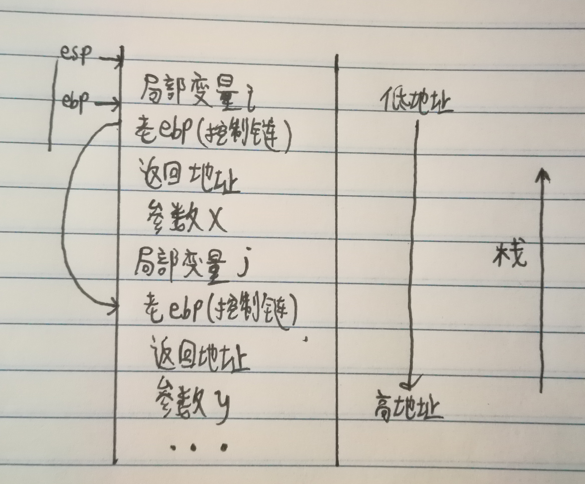
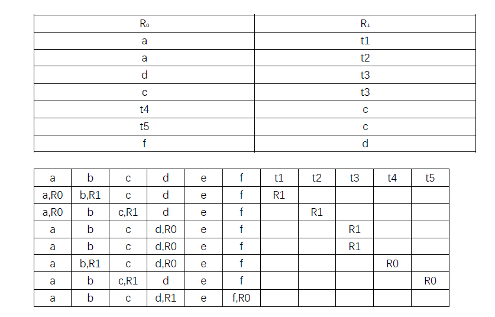

# HW14
## 6.6

## 6.10
三个形参进栈顺序为从右向左，func(i1,i2,i3)按照i3 i2 i1的顺序进栈，i1在栈顶，对应地址最低。而局部变量的进栈顺序为从左向右，进栈顺序为j1 j2 j3，j3在栈顶，对应的地址最低。所以func函数的三个形参的地址依次升高，局部变量的地址依次降低。
## 6.13
### (a)
fact函数的三个参数入栈的顺序是15 10 5，栈顶元素为5，函数调用时读取栈顶元素5直接作为参数执行了fact函数，所以不受参数过多影响
### (b)
5.0为double类型，而fact声明为int类型，占用的存储空间不同导致了识别到1，所以返回值为1
### (c)
第四个fact调用时实参为空，则栈顶的局部变量为空，esp指针直接指向了控制链。控制链是一个非常大的整数，进而导致了爆栈，出现segmentation fault
## PPT P53
t1 = a + b  
t2 = t1 - c  
t3 = d + e  
t3 = t2 * t3  
t4 = t1 + t3  
t5 = t3 - e  
f = t4 * t5  

```
LD R0,a
LD R1,b
ADD R1,R0,R1
ST b,R1
LD R1,c
SUB R1,R0,R1
ST c,R1
LD R0,d
LD R1,e
ADD R1,R0,R1
LD R0,c
MUL R1,R0,R1
ST d,R1
LD R1,b
ADD R0,R0,R1
ST d,R0
LD R0,e
SUB R0,R1,R0
LD R1,d
MUL R0,R0,R1
ST f,R0
```

总代价35