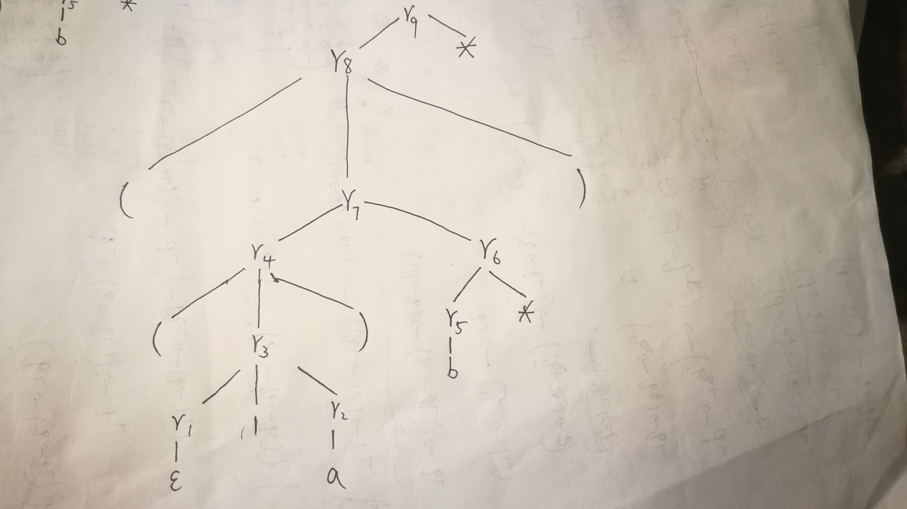
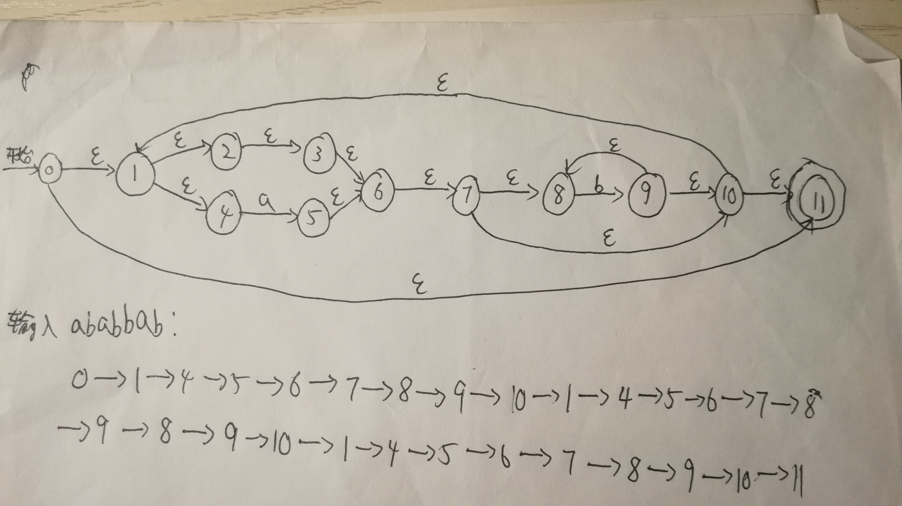
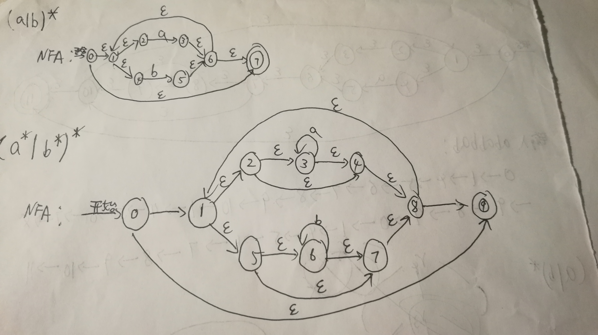
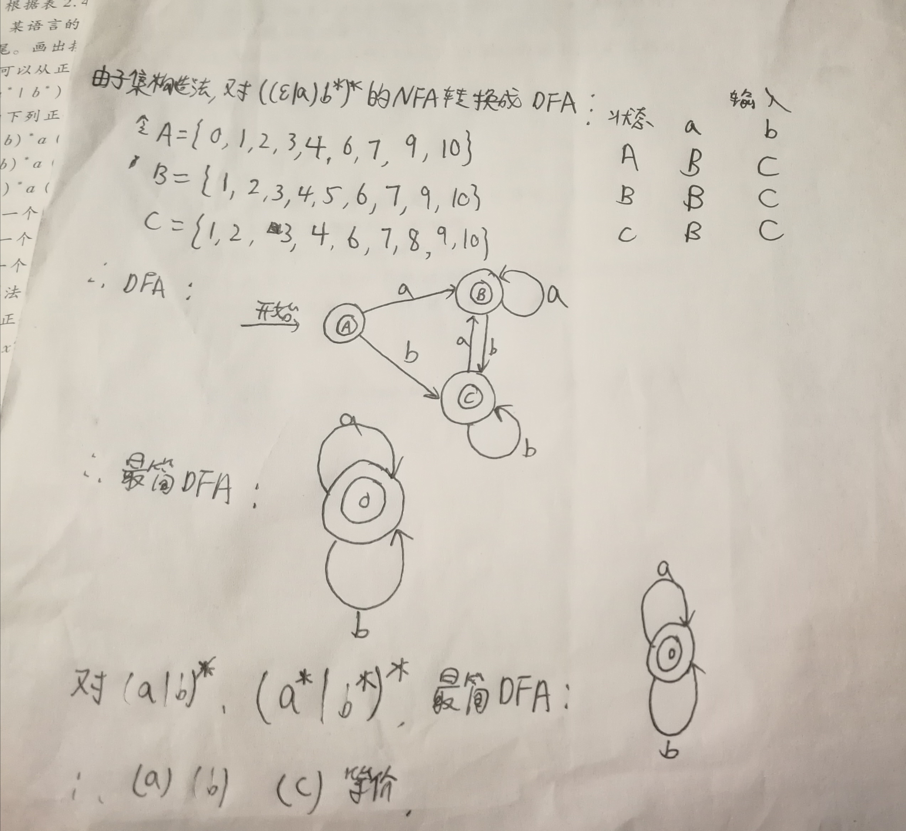
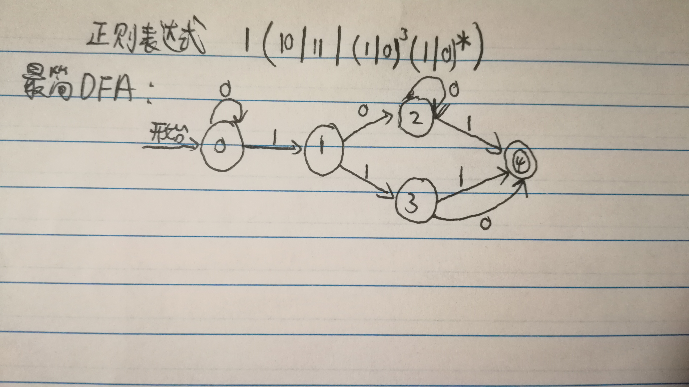

# HW2
## 2.1 (e)
Unicode &emsp;utf-8
## 2.2
&lt;long&gt; &lt;id,指向符号表中gcd条目的指针&gt; &lt;(&gt; &lt;long&gt; &lt;id,指向符号表中p条目的指针&gt; &lt;,&gt; &lt;long&gt; &lt;id,指向符号表中q条目的指针&gt; &lt;)&gt; &lt;{&gt;   
&lt;if&gt; &lt;(&gt; &lt;id,指向符号表中p条目的指针&gt; &lt;%,op&gt; &lt;id,指向符号表中q条目的指针&gt; &lt;=,op&gt; &lt;=,op&gt; &lt;0,num&gt; &lt;)&gt;  
&lt;return&gt; &lt;id,指向符号表中q条目的指针&gt; &lt;;&gt;  
&lt;else&gt;  
&lt;return&gt; &lt;id,指向符号表中gcd条目的指针&gt; &lt;(&gt; &lt;id,指向符号表中q条目的指针&gt; &lt;,&gt; &lt;id,指向符号表中p条目的指针&gt; &lt;%,op&gt; &lt;id,指向符号表中q条目的指针&gt; &lt;)&gt;  
&lt;}&gt;
## 2.3 (e)
偶数个0和偶数个1构成的所有串的集合，包括空串
## 2.4
(a) &emsp; 设 $\varepsilon$：是不含元音字母的任意串，即$\varepsilon\rightarrow$[B-DF-HJ-NP-TV-Zb-df-hj-np-tv-z]所以原题中的字母串可以表示为：$\varepsilon$\*(A|a)$\varepsilon$\*(E|e)$\varepsilon$\*(I|i)$\varepsilon$\*(O|o)$\varepsilon$\*(U|u)$\varepsilon$\*  
(f) &emsp; (00|11)\*((01|10)(00|11)\*(01|10)(00|11)\*)\*  
(i) &emsp; b\*((ab)b\*)\*((ba)b\*)\*
## 2.7 (c)

## 2.11

(($\varepsilon$|a)b\*)\*的NFC同2.7(c)

## 2.15
从高位到低位输入：
