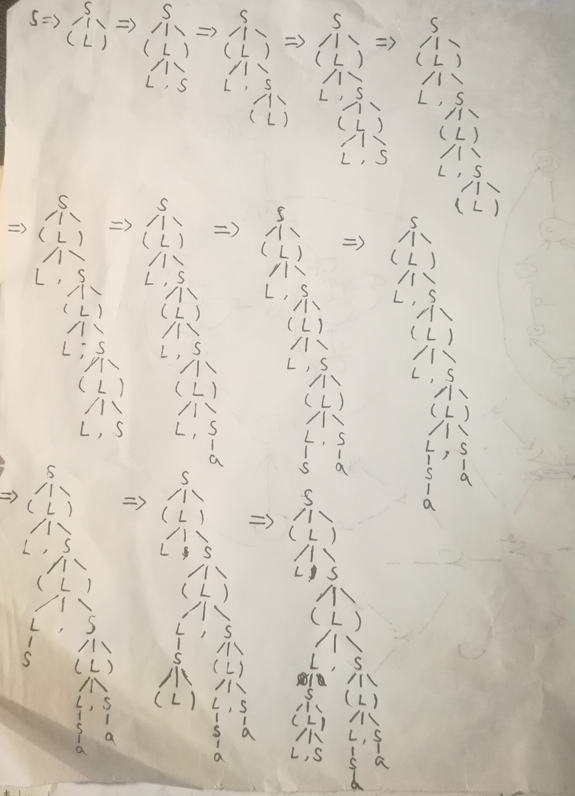

# HW3
## 3.1 (a)
均采用最右推导：  
S→(L)→(L,S)→(L,(L))→(L,(L,S))→(L,(L,a))→(L,(S,a))→(L,(a,a))→(S,(a,a))→(a,(a,a))

S→(L)→(L,S)→(L,(L))→(L,(L,S))→(L,(L,(L)))→(L,(L,(L,S)))→(L,(L,(L,a)))→(L,(L,(S,a)))→(L,(L,(a,a)))→(L,(S,(a,a)))→(L,((L),(a,a)))→(L,((L,S),(a,a)))→(L,((L,a),(a,a)))→(L,((S,a),(a,a)))→(L,((a,a),(a,a)))→(S,((a,a),(a,a)))→(a,((a,a),(a,a)))

## 3.1 (b)
S→(L)→(L,S)→(S,S)→(a,S)→(a,(L))→(a,(L,S))→(a,(S,S))→(a,(a,S))→(a,(a,a))  
S→(L)→(L,S)→(S,S)→(a,S)→(a,(L))→(a,(L,S))→(a,(S,S))→(a,((L),S))→(a,((L,S),S))→(a,((S,S),S))→(a,((a,S),S))→(a,((a,a),S))→(a,((a,a),(L)))→(a,((a,a),(L,S)))→(a,((a,a),(S,S)))→(a,((a,a),(a,S)))→(a,((a,a),(a,a)))
## 3.6 (b)
S→aSbS | bSaS | ε   不是正规的
## 3.6 (c)
S1→aSbS | bSaS | ε  是a和b个数相等的串  
S→a+S1a\* | a*S1a+ | b\*S1b+ | b+S1b\*  
S不是正规的
## 3.8 (a)
S→(L) | a  
L→SL'  
L'→,SL' | ε
## 3.8 (b)
First(S)={(,a}  
First(L)=First(S)={(,a}  
First(L')={,，ε}  
Follow(L)={)}  
Follow(L')={),\$}  
Follow(S)={,，)，\$}  

## 3.10
First(D)=First(T)={int,real}  
First(L)={id}  
First(R)={,，ε}  
Follow(D)={\$}  
Follow(L)={\$}  
Follow(T)={id}  
Follow(R)={\$}  

## 3.11
First(S)={a,b,ε}  
First(A)={b,a}  
First(B)={a,b}  
Follow(S)={\$}  
Follow(A)={a,b,\$}  
Follow(B)={a,b,\$}  

## 3.12
First(AB)={x}  
First(PQx)={d,ε}  
First(AB) ∩ First(PQx)= Ø  
PQx无法推出ε  
ε=>\*ε  
Follow(P)={a,\$}  
First(dP)={d}  
First(dP) ∩ Follow(P)= Ø  
Follow(Q)={x,\$}  
First(aQ)={a}  
First(aQ) ∩ Follow(Q)= Ø  
所以是LL(1)文法