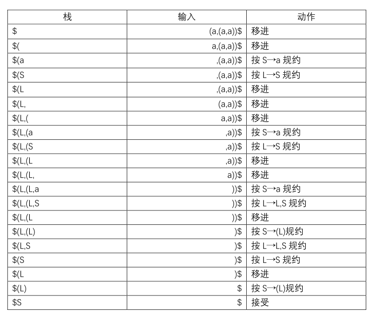
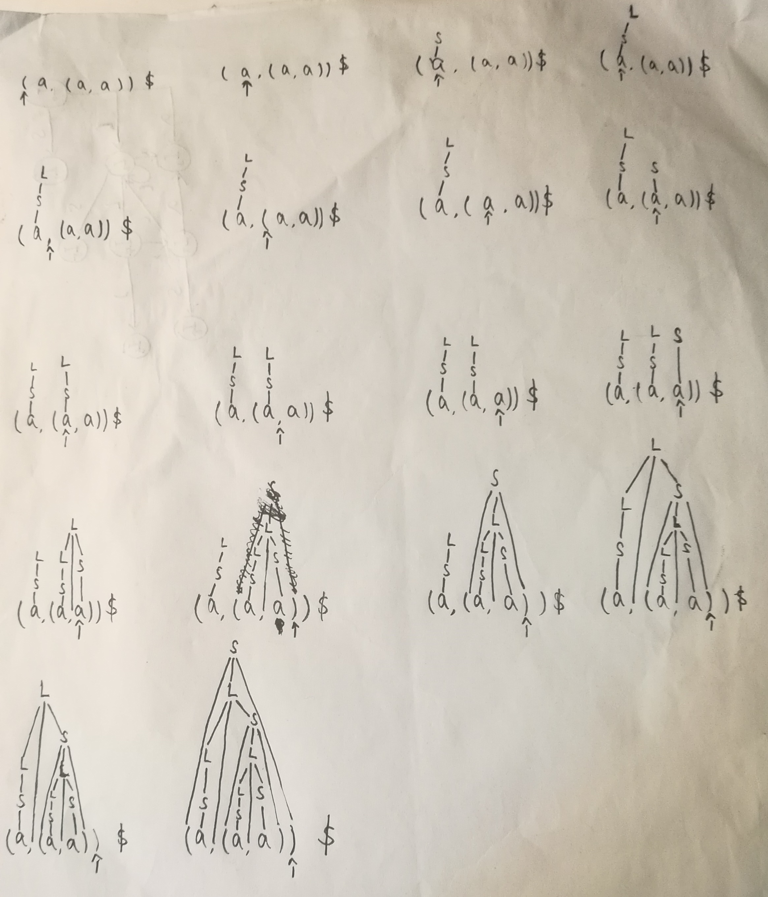
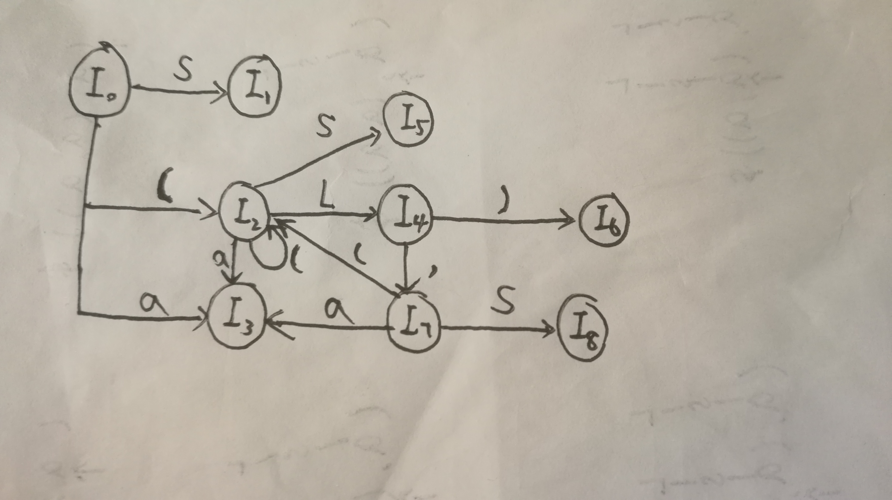
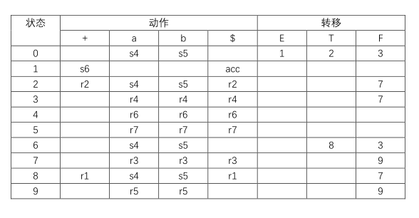

# HW4
## 3.16
### 3.16(a)
S⇒rm<u>(L)</u>⇒rm(<u>L,S</u>)⇒rm(L,<u>(L)</u>)⇒rm(L,(<u>L,S</u>))⇒rm(L,(L,<u>a</u>))⇒rm(L,(<u>S</u>,a))⇒rm(L,(<u>a</u>,a))⇒rm(<u>S</u>,(a,a))⇒rm(<u>a</u>,(a,a))
### 3.16(b)

### 3.16(c)

## 3.17
拓广文法：  
S'→S  
S→(L) | a  
L→L,S | S  
I0=closure(I)  
I0:S'→ · S  
&emsp;S→ · (L)  
&emsp;S→ · a  
I1=goto(I0,S)  
I1:S'→S ·   
I2=goto(I0,( )   
I2:S→( · L)  
&emsp;L→ · L,S  
&emsp;L→ · S  
&emsp;S→ · (L)  
&emsp;S→ · a  
I3=goto(I0,a)  
I3:S→a ·   
I4=goto(I2,L)  
I4:S→(L · )  
&emsp;L→L · ,S  
I5=goto(I2,S)  
I5:L→S ·     
goto(I2,( )=I2  goto(I2,a)=I3  
I6=goto(I4,) )  
I6:S→(L) ·   
I7=goto(I4, ,)  
I7:L→L, · S  
&emsp;S→ · (L)  
&emsp;S→ · a  
I8=goto(I7,S)  
I8:L→L,S ·   
goto(I7,( )=I2  goto(I7,a)=I3  

## 3.19(a)
拓广文法：  
E'→E  
E→E+T | T  
T→TF | F  
F→F* | a | b   
I0=closure(I)  
I0:E'→·E  
&emsp;E→·E+T  
&emsp;E→·T  
&emsp;T→·TF  
&emsp;T→·F  
&emsp;F→·F*  
&emsp;F→·a  
&emsp;F→·b  
I1=goto(I0,E)  
I1:E'→E·  
&emsp;E→E·+T  
I2=goto(I0,T)  
I2:E→T·  
&emsp;T→T·F  
&emsp;F→·F*  
&emsp;F→·a  
&emsp;F→·b  
I3=goto(I0,F)  
I3:T→F·  
&emsp;F→F·F*  
&emsp;F→·a  
&emsp;F→·b  
I4=goto(I0,a)  
I4:F→a·    
I5=goto(I0,b)  
I5:F→b·    
I6=goto(I1,+)  
I6:E→E+·T  
&emsp;T→·TF  
&emsp;T→·F  
&emsp;F→·F*  
&emsp;F→·a  
&emsp;F→·b    
I7=goto(I2,F)  
I7:T→TF·  
&emsp;F→F·F*  
&emsp;F→·a  
&emsp;F→·b  
goto(I2,a)=I4  goto(I2,b)=I5  
I8=goto(I6,T)  
I8:E→E+T·  
&emsp;T→T·F  
&emsp;F→·F*  
&emsp;F→·a  
&emsp;F→·b    
goto(I6,F)=I3  goto(I6,a)=I4  goto(I6,b)=I5  goto(I8,F)=I7  goto(I8,a)=I4  goto(I8,b)=I5  
I9=goto(I7,F)  
I9:F→F·F*  
&emsp;F→·a  
&emsp;F→·b  
goto(I9,F)=I9  
