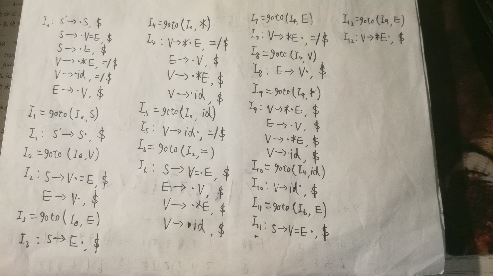
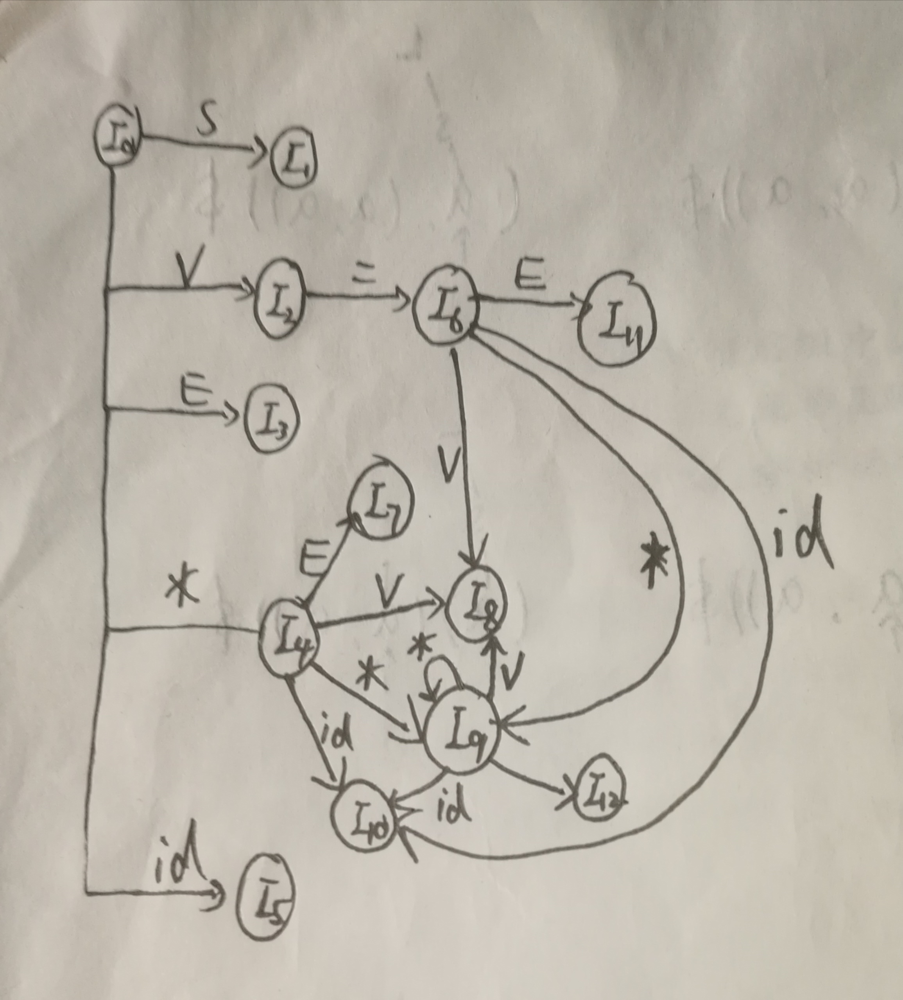

# HW5
## 3.21(a)
First(AaAb)=ε  
First(BbBa)=ε    
First(AaAb) ∩ First(BbBa)=Ø  
BbBa无法推出ε  
所以文法是LL（1）文法  
对此文法做拓广：  
S'→S  
S→AaAb  
S→BbBa  
A→ε  
B→ε  
则I0：S'→·S  S→·AaAb  S→·BbBa  A→·  B→·  
对于I0，action[0,A]={a,b},action[0,B]={a,b},规约冲突，所以不是SLR（1）
## 3.25
拓广文法：  
L'→L  
L→MLb | a  
M→ε  
I0:L'→·L  
&emsp;L→·MLb,$  
&emsp;L→·a,$  
&emsp;M→·,a  
I1=goto(I0,L)  
I1:L'→L·,$  
I2=goto(I0,M)  
I2:L→M·Lb,$  
&emsp;L→·MLb,b  
&emsp;L→·a,b  
&emsp;M→·,a  
I3=goto(I0,a)  
I3:L→a·,$    
I4=goto(I2,L)  
I4:L→ML·b,$  
I5=goto(I2,M)  
I5:L→M·Lb,b   
&emsp;L→·MLb,b  
&emsp;L→·a,b  
&emsp;M→·,a  
I6=goto(I2,a)  
I6:L→a·,b  
I7=goto(I4,b)  
I7:L→MLb·,$  
I8=goto(I5,L)  
I8:L→ML·b,b  
goto(I5,M)=I5    
I9=goto(I8,b)  
I9:L→MLb·,b  
所以I0 I2 I5面临a产生移进规约冲突，由此可以说明不是LR(1)
## 3.27
### 3.27(a)
以下皆为非负数：  
S：整数或小数  
I：整数  
R：浮点数  
W：整数或浮点数整数部分  
F：浮点数小数部分  
### 3.27(b)
拓广文法：  
S'→S  
S→I | R  
I→d | Id  
R→WpF  
W→Wd | ε  
F→Fd | d  
I0=closure(I)  
I0:S'→·S,$  
&emsp;S→·I,$  
&emsp;S→·R,$  
&emsp;I→·d,$ / d  
&emsp;I→·Id,$ / d  
&emsp;R→·WpF,$  
&emsp;W→·Wd,p/d  
&emsp;W→·,p/d  
&emsp;F→·Fd,d/$  
&emsp;F→·d,d/$  
显然I0面临p/d存在移进规约冲突所以不是LR(1)文法  
## 3.29
### 3.29(a)

### 3.29(b)
有，合并同心项目集后I9 I10 I12状态被合并，没有冲突
## 3.30
产生的语言是在任何位置截断时，前缀中a的个数比b多的字符串  
S→aS' | ε  
S'→S | TbS  
T→S | ε  
即为所求