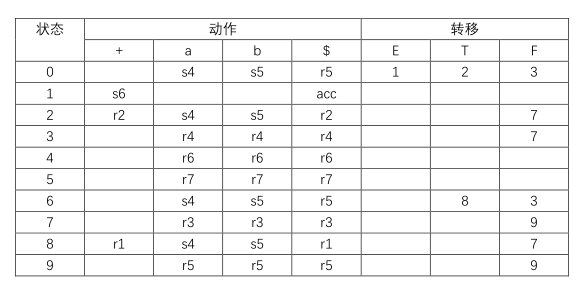
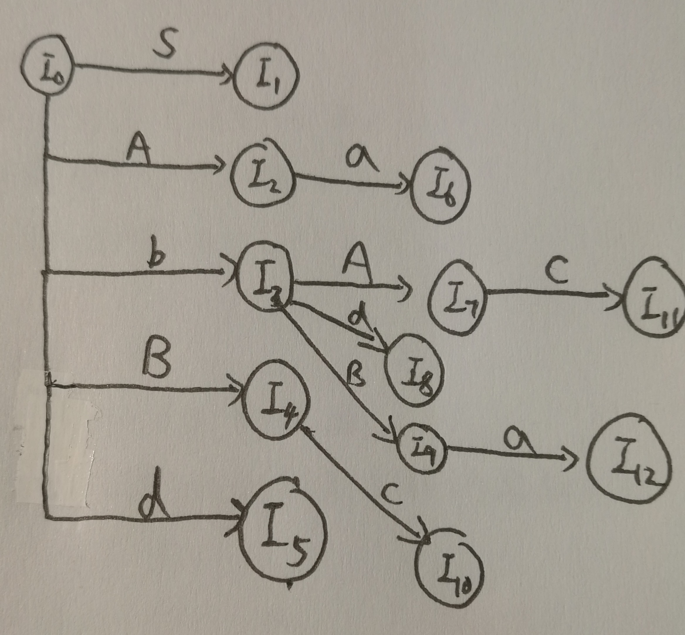
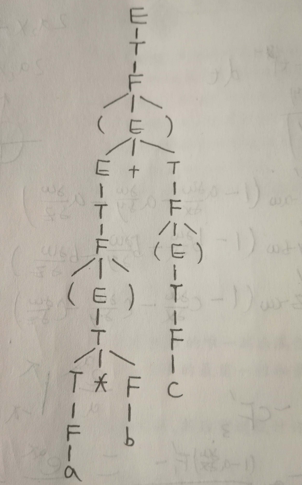
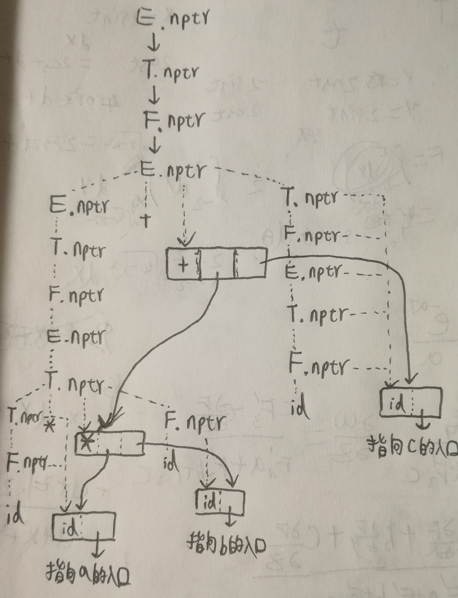

# HW6
## 3.19(b)
拓广文法：  
E'→E  
E→E+T | T  
T→TF | F  
F→F* | a | b   
I<sub>0</sub>=closure(I)  
I<sub>0</sub>:E'→·E,$  
&emsp;E→·E+T,+/$  
&emsp;E→·T,+/$  
&emsp;T→·TF,a/b/$  
&emsp;T→·F,a/b/$  
&emsp;F→·F*,a/b/$  
&emsp;F→·a,a/b/$  
&emsp;F→·b,a/b/$  
I<sub>1</sub>=goto(I<sub>0</sub>,E)  
I<sub>1</sub>:E'→E·,$  
&emsp;E→E·+T,+/$  
I<sub>2</sub>=goto(I<sub>0</sub>,T)  
I<sub>2</sub>:E→T·,+/$  
&emsp;T→T·F,a/b/$  
&emsp;F→·F*,a/b/$  
&emsp;F→·a,a/b/$  
&emsp;F→·b,a/b/$  
I<sub>3</sub>=goto(I<sub>0</sub>,F)  
I<sub>3</sub>:T→F·,a/b/$  
&emsp;F→F·F*,a/b/$  
&emsp;F→·a,a/b/$  
&emsp;F→·b,a/b/$  
I<sub>4</sub>=goto(I<sub>0</sub>,a)  
I<sub>4</sub>:F→a·,a/b/$    
I<sub>5</sub>=goto(I<sub>0</sub>,b)  
I<sub>5</sub>:F→b·,a/b/$    
I<sub>6</sub>=goto(I<sub>1</sub>,+)  
I<sub>6</sub>:E→E+·T,+/$  
&emsp;T→·TF,a/b/$  
&emsp;T→·F,a/b/$  
&emsp;F→·F*,a/b/$  
&emsp;F→·a,a/b/$  
&emsp;F→·b,a/b/$    
I<sub>7</sub>=goto(I<sub>2</sub>,F)  
I<sub>7</sub>:T→TF·,a/b/$  
&emsp;F→F·F*,a/b/$  
&emsp;F→·a,a/b/$  
&emsp;F→·b,a/b/$  
goto(I<sub>2</sub>,a)=I<sub>4</sub>  goto(I<sub>2</sub>,b)=I<sub>5</sub>  
I<sub>8</sub>=goto(I<sub>6</sub>,T)  
I<sub>8</sub>:E→E+T·+/$  
&emsp;T→T·F,a/b/$  
&emsp;F→·F*,a/b/$  
&emsp;F→·a,a/b/$  
&emsp;F→·b,a/b/$    
goto(I<sub>6</sub>,F)=I<sub>3</sub>  goto(I<sub>6</sub>,a)=I<sub>4</sub>  goto(I<sub>6</sub>,b)=I<sub>5</sub>  goto(I<sub>8</sub>,F)=I<sub>7</sub>  goto(I<sub>8</sub>,a)=I<sub>4</sub>  goto(I<sub>8</sub>,b)=I<sub>5</sub>  
I<sub>9</sub>=goto(I<sub>7</sub>,F)  
I<sub>9</sub>:F→F·F*,a/b/$  
&emsp;F→·a,a/b/$  
&emsp;F→·b,a/b/$  
goto(I<sub>9</sub>,F)=I<sub>9</sub>  

## 3.24
拓广文法：  
S'→S  
S→Aa | bAc | Bc | bBa  
A→d  
B→d  
I<sub>0</sub>=closure(I)  
I<sub>0</sub>:S'→·S,$  
&emsp;S→·Aa,$  
&emsp;S→·bAc,$  
&emsp;S→·Bc,$  
&emsp;S→·bBa,$  
&emsp;A→·d,a  
&emsp;B→·d,c  
I<sub>1</sub>=goto(I<sub>0</sub>,S)  
I<sub>1</sub>:S'→S·,$  
I<sub>2</sub>=goto(I<sub>0</sub>,A)  
I<sub>2</sub>:S→A·a,$   
I<sub>3</sub>=goto(I<sub>0</sub>,b)  
I<sub>3</sub>:S→b·Ac,$  
&emsp;A→·d,c  
&emsp;S→b·Ba,$  
&emsp;B→·d,a  
I<sub>4</sub>=goto(I<sub>0</sub>,B)  
I<sub>4</sub>:S→B·C,$  
I<sub>5</sub>=goto(I<sub>0</sub>,d)  
I<sub>5</sub>:A→d·,a  
&emsp;B→d·,c  
I<sub>6</sub>=goto(I<sub>2</sub>,a)  
I<sub>6</sub>:S→Aa·,$  
I<sub>7</sub>=goto(I<sub>3</sub>,A)  
I<sub>7</sub>:S→bA·c,$  
I<sub>8</sub>=goto(I<sub>3</sub>,d)  
I<sub>8</sub>:A→d·,c  
&emsp;B→d·,a  
I<sub>9</sub>=goto(I<sub>3</sub>,B)  
I<sub>9</sub>:S→bB·a,$  
I<sub>10</sub>=goto(I<sub>4</sub>,c)  
I<sub>10</sub>:S→Bc·,$  
I<sub>11</sub>=goto(I<sub>7</sub>,c)  
I<sub>11</sub>:S→bA·c,$  
I<sub>12</sub>=goto(I<sub>9</sub>,a)  
I<sub>12</sub>:S→bB·a,$  

根据项目集和状态图可见此文法为LR(1)文法，且没有同心项目集，所以不是LALR(1)文法
## 4.2(a)
分析树：

语法树：

## 4.3
### 4.3(a)
```
S'→S        ｛print(S.num);｝
S→(L)       ｛S.num=L.num+1;｝
S→a         ｛S.num=0;｝
L→L1,S      ｛L.num=L1.num+S.num;｝
L→S         ｛L.num=S.num;｝
```
### 4.3(b)
```
S'→S        ｛print(S.max);｝
S→(L)       ｛S.max=L.max+1;｝
S→a         ｛S.max=0;｝
L→L1,S      ｛L.max=L1.max>S.max? 
                L1.max:S.max;｝
L→S         ｛L.max=S.max;｝
```
## 4.5
```
S'→S               {print(S.max);}
S→E                {S.max=E.max;}
E→while E1 do E2   {E.max=E1.max>E2.max?
                       E1.max+1:E2.max+1;}
E→id :=E1          {E.max=E1.max;}
E→E1+E2            {E.max=E1.max>E2.max?
                       E1.max:E2.max;}
E→id               {E.max=0;}
E→(E1)             {E.max=E1.max;}
```
## 例3
```
S'→S               {print(S.val);}
S→L.R              {S.val=L.val+R.val;
                    L.cnt=0;}  
S→L                {S.val=L.val}
L→L1B              {B.cnt++;
                    L.val=L1.val+2^B.cnt*B.val}
R→BR1              {R.val=R1.val/2+B.val/2;}
R→B                {R.val=B.val/2;}
L→B                {L.val=B.val
                    B.cnt=L.cnt}
B→0                {B.val=0;}
B→1                {B.val=1;}
```