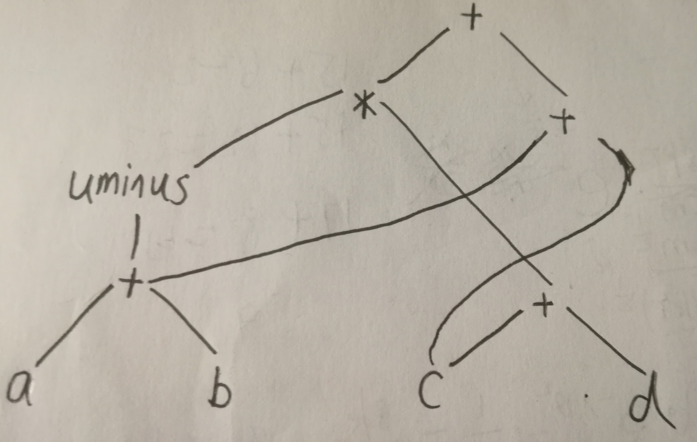
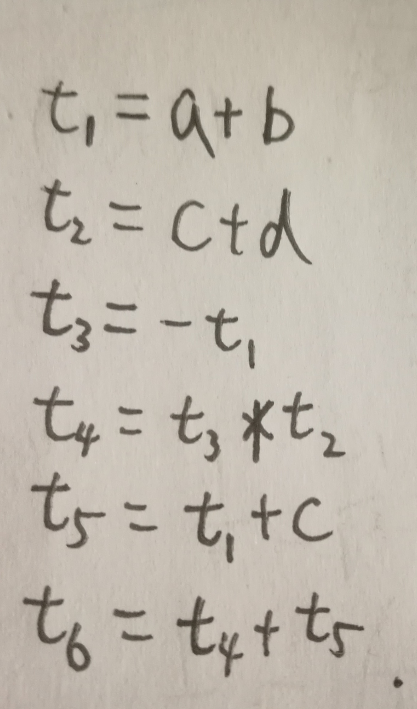

# HW8
## 7.1
### (a)

### (b)

## Slide P66
```
L0: if a>5 goto L1
    goto Lf
L1: if b<1 goto L2
    goto Lf
L2: t1=0
    i=t1
    goto L3
L3: if i<=100 goto Lw
    goto Le
Lw: t2=i+1
    i=t2
    goto L3
Lf: t3=x+5
    x=t3
    goto Le
Le:
```