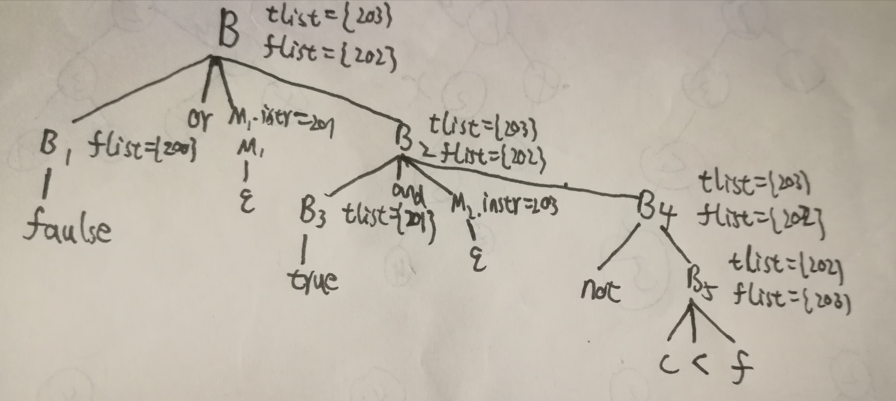

# HW9
### 布尔表达式：false or true and not c < f
```
200:    goto 201
201:    goto 202
202:    if not c < f goto -
203:    goto -
```

规约到B2时，用M2将B3 tlist={201}回填掉，即回填掉了goto 203  
规约到B时，用M1将B1 flist={200}回填掉，即回填掉了goto 201