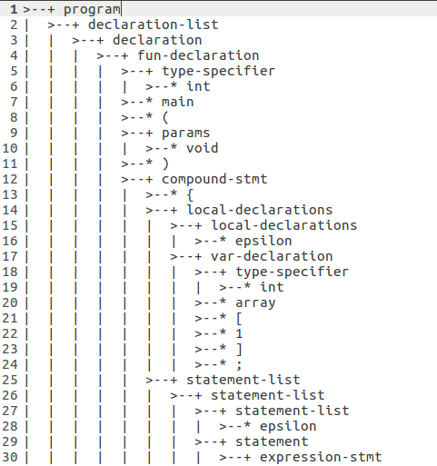
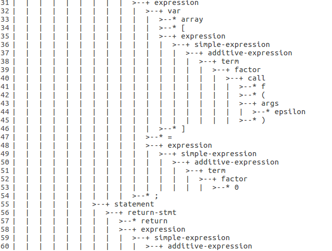
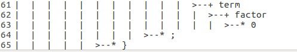
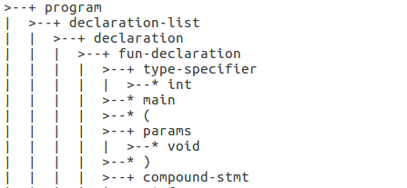

## lab2实验报告

王嵘晟  

PB17111614

### 实验要求

&emsp;&emsp;基于LAB1完成的C-语言的词法分析器，借助bison语言，根据给出的文法，实现一个C-语言的语法分析器。要求输入一个C-语言代码，输出语法分析树。

### 实验设计

1. flex词法分析的结果作为bison输出语法树的叶子结点，所以共享变量使用一个联合体：
```
    SyntaxTreeNode * node;
```
2. 书写移进规约规则时严格按照产生式的逻辑书写，根据产生式推出符号右边的元素个数来确定叶子结点的个数。将树的结点名字命名为产生式推出符号左边的声明。叶子结点名字命名为规约前被分析的C-代码中的内容。
3. 对 getalltestcase 函数进行修改，读C-代码的同时对读到的代码数量计数。
### 实验结果




&emsp;&emsp;语法分析器自下而上分析语法，用移位规约分析方法，属于LR文法  
例如这里：

一共用到了
```
    program → declaration-list
    declaration-list → declaration
    declaration → fun-declaration
    fun-declaration → type-specifier ID (params) compound-stmt
```
&emsp;&emsp;这些产生式，调用顺序同产生式顺序。ID的值来自lab1中词法分析器的输出结果，type-specifier是函数类型声明，此处为int
### 实验难点

1. git pull 时由于建立的remote upstream有问题，花费了很长的时间解决不了问题。最后通过查询CSDN，得以解决。
2. git merge时提示有各种冲突，用vscode打开冲突代码，通过对比选择需要的代码块，然后重新git add , git commit解决冲突
3. 完成cmake后，对测试样例执行语法分析，但生成的语法树为空。经过反复调试，发现由于在lab1中将error写在了最后，于是lab2的tokens中也把error写在了最后。将tokens顺序修正，解决了问题。
4. lab1中对于多行注释的测试样例不对的问题进行了修改，改进了正则表达式，并且通过字符串处理将注释中行数和实际每行中的列数标注出来，解决了lab1中multi-comment样例不对的问题。

### 实验总结

&emsp;&emsp;本次实验使用bison完成了语法分析器的创建，承接了lab1中的词法分析器，为接下来的实验做了准备。对于共用体、bison和cmake的使用有了一定了解。

### 实验反馈

1. 希望助教可以在公布实验前编写tutorial时更加细致一点，对于初学者很多时候tutorial让人不明觉厉。
2. 助教给的样例以及代码可以少一点错误，以防让我们无谓的消耗过多时间
3. 差不多这些了，助教们加油！

