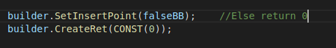

## lab3-0实验报告

王嵘晟

PB17111614

### 实验要求

1. 下载LLVM源码并完成编译，学习在bash模式的shell下配置path环境变量；
2. 根据助教给的 gcd.c 的例子，用LLVM机器翻译，学习如何将.c代码翻译成.ll汇编代码；
3. 根据助教给出的 gcd_generator.cpp 代码，学习用cpp直接翻译生成LLVM IR文件；
4. 通过上面的对机器翻译生成的LLVM IR文件的学习，手工翻译四个简单的C语言代码；
5. 通过对用cpp直接翻译生成LLVM IR的学习，对四个C语言代码编写cpp文件用以生成LLVM IR；
6. 在此过程学习vscode中AutoComplete配置，方便编写代码；

### 实验结果

1. assign_generator.cpp中，只有主函数main中有一个BasicBlock,命名为entry。在手工翻译的LLVM IR代码中对应label 0；  
   这是assign_generator.cpp中的代码：
     
   对应在生成的LLVM IR文件中对应的代码块命名为entry，内容如下：  
     
2. if_generator.cpp中，有3个BasicBlock，entry trueBB和falseBB。entry对应%1，trueBB是icmp判别结果为true的分枝，falseBB是icmp判别结果为false的分枝。由于这里2&gt;1是铁定为真的，因此br直接进入true；  
   if_generator.cpp中命名为entry的代码块：  
     
   其对应的生成的LLVM IR文件中对应的代码块为：  
     
   if_generator.cpp中命名为trueBB的代码块：  
     
   其对应的生成的LLVM IR文件中对应的代码块为：  
     
   if_generator.cpp中命名为falseBB的代码块：  
     
   其对应的生成的LLVM IR文件中对应的代码块为：  
     
3. while_generator.cpp中，有4个BasicBlock，entry whileBB trueBB falseBB，entry对应手工翻译中的label 0，whileBB用来维持循环，对应label 4，trueBB对应label 7，falseBB对应label 13；
   while_generator.cpp中命名为entry的代码块：  
     
   其对应的生成的LLVM IR文件中对应的代码块为：  
     
   while_generator.cpp中命名为whileBB的代码块：  
     
   其对应的生成的LLVM IR文件中对应的代码块为：  
     
   while_generator.cpp中命名为trueBB的代码块：  
     
   其对应的生成的LLVM IR文件中对应的代码块为：  
     
   while_generator.cpp中命名为falseBB的代码块：  
     
   其对应的生成的LLVM IR文件中对应的代码块为：  
       
4. call_generator.cpp中，有个BasicBlock，两个函数的entry。两个函数的entry都对应label 0；    
   while_generator.cpp中callee moudle中命名为entry的代码块：  
     
   其对应的生成的LLVM IR文件中对应的代码块为：  
     
    while_generator.cpp中main moudle中命名为entry的代码块：  
     
   其对应的生成的LLVM IR文件中对应的代码块为：  
   
### 实验难点

1. LLVM机器翻译时对于代码逻辑的优化：在手工翻译if.c时，很naive地试着一条一条地将C语言翻译成LLVM IR：
  
但是通过参考机器翻译的结果发现LLVM翻译时可以对代码逻辑实现优化，if判断语句的返回值一定为true，因此br可以直接指向true;
2. 编写call_generator.cpp时，由于这里涉及函数调用以及传参，一开始写出来得cpp生成的LLVM IR文件运行起来总是segmentation fault，经过仔细阅读代码发现是在calle函数中不慎调用了它自己变成了没有终止的递归。修改代码解决问题；
3. 编写while_generator.cpp时正常编译后生成的LLVM IR文件运行结果总是55，怀疑是循环中语句有逻辑问题。通过一行行注释debug发现在while循环中计算了i=i+1后在计算a=a+i时没有load到及时更新的i，添加一行代码
```
      iLoad = builder.CreateLoad(iAlloca);
```
   &emsp;&emsp;可以解决问题；
### 实验总结

1. 此次实验学习了LLVM对C语言代码进行机器翻译的方法，并手工完成了翻译。掌握了一定的手工翻译能力；
2. 学习了如何通过编写cpp文件来翻译C语言代码为LLVM IR文件，为以后的实验做基础；
3. 我认为此次试验最关键的是学习了vscode中.json文件合理配置include路径以实现AutoComplete功能，这样对于编写代码有极大的时间节省；
