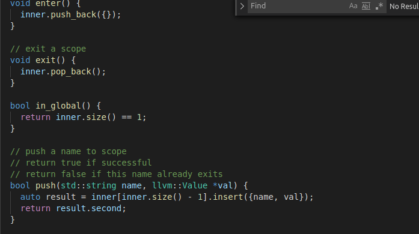
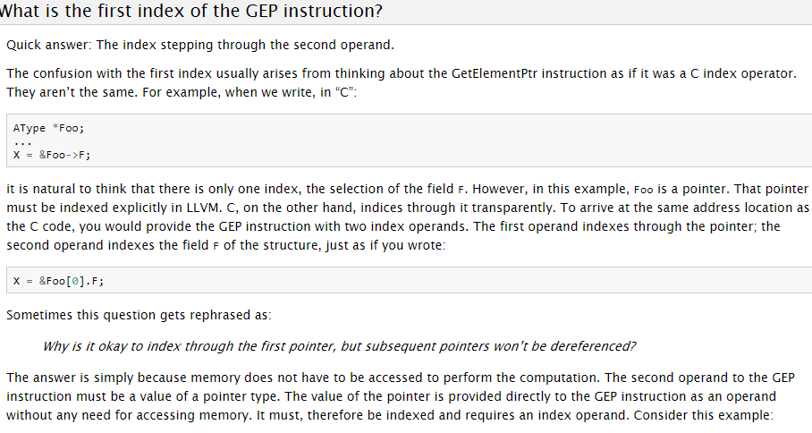
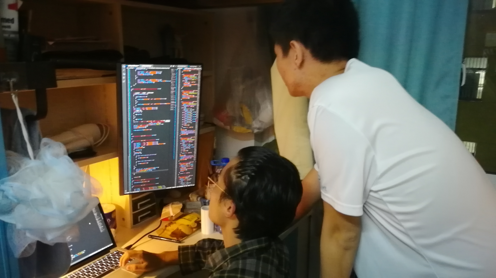
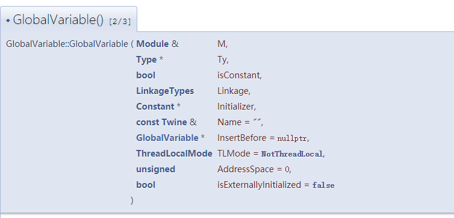
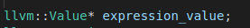
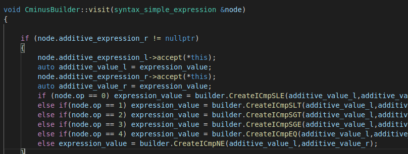

# 团队工作记录

记录团队的学习过程和讨论过程，

## 学习过程

描述队长如何安排成员进行学习工作，并描述完成情况
1. 在实验布置后，由于恰逢期中考试周。所以我们小组只大致布置了一下当周的任务，即在复习考试的课余时间适当阅读一下代码，对于我们要做的工作有一个大致了解。
2. 考试周后，我们组的组长李岸宜随即对分工进行了安排。由于我们是两人组队，所以每个人的工作量都比较大。对于代码部分的大致分工是16个函数李岸宜同学写前一半，王嵘晟同学写后一半，由于有些函数需要依赖其他函数的结果，所以在实际操作中与分工略有不同。
3. 我们也做好了对于编写完代码后debug的分工，由于系统兼容性问题，王嵘晟同学负责找bug，然后两个人共同debug。
4.  对于编写代码遇到的问题，我们除了组内讨论外，还寻求了大佬的帮助。在ISSUE、GOOGLE、以及大佬的三重帮助下，得以解决。
## 讨论1

时间：11月16日 14时到17时
地点：寝室
参与者：李岸宜 王嵘晟
主题：第一次讨论————对于头文件的研读
[讨论的照片或截图]

### 过程描述
1.首先我们对于之前各自阅读sytax_tree.hpp和cminus_builder.hpp的心得和遇到的问题进行了交流。比如我们交换了两个人对于scope类的理解，并在GOOGLE的帮助下解决了其中的疑惑。
2.然后我们明确做出了分工，对于接下来实验该如何进行做了划分，分工结果如上。
### 结论
1.我们对于C++语法的理解还是过于浅显，接下来的几天除了要继续阅读代码以及开始尝试写代码以外还要多去熟悉C++语法。

## 讨论2
时间：11月18日 18时到19时
地点：寝室
参与者：李岸宜 王嵘晟
主题：第二次讨论————对于var中数组访问的疑惑
[讨论的照片或截图]

### 过程描述
1. 我们处理前几个函数时进展还比较顺利，不过到了对于变量声明这里遇到了很严重的困惑。对于ID的的处理比较容易，但对于数组ID[num]的处理就不知道改从何下手了。
2. 对于这个困惑，我们翻看了snytax_tree.hpp试着理解在建树的时候对于数组是如何处理的，但是并没有得到什么好的解决方案。
3. 后来经过讨论和头脑风暴，我们列出来了诸多可能的数组的表示方法，感觉可能需要写一个branch才能解决……
4. 最后我们翻看了助教提供的ppt，发现可以用使用 CreateGEP 来创建getelementptr 以访问数组元素。
5. 翻看LLVM官网对此方面的介绍后，我们还是不知道该从何下手。
### 结论
1.本次讨论没有建设性成果。

## 讨论3
时间：11月19日 22时到23时
地点：寝室
参与者：李岸宜 王嵘晟 罗极羽
主题：第三次讨论————解决var中数组访问的问题
[讨论的照片或截图]

### 过程描述
1.由于上一次讨论没有建设性成果，我们的实验也卡在了这里。所以本次讨论特地请教了解决了这个问题的罗极羽同学，如何解决数组访问问题。
2.在罗极羽同学的指引下，我们摸索出了自己的方法，如下结论所述。
### 结论
1.对于数组的访问可以通过使用 CreateGEP 来创建getelementptr，我们对数组访问的实际操作是对于数组a[n]，将a[0],a[1],a[2]...a[n-1]逐个地压入scope中，希望以此能够解决问题。

## 讨论4
时间：11月20日 18时到19时
地点：寝室
参与者：李岸宜 王嵘晟 
主题：第四次讨论————探究如何处理全局变量的声明
[讨论的照片或截图]

### 过程描述
1.在写var_declaration时，虽然我们看到了实验ppt上的提示以及LLVM官网中GlobalVariable的两种API，但是对于这些API的参数内容应该填什么并不清楚。
2.我们对于这个问题进行了讨论，最后一致认为需要初始化的东西我们在这里都不用考虑，即我们只需要填写API的前五个内容就可以了。
### 结论
1.试着对全局变量的声明进行了处理，不过Constant*应该填写的内容依旧不知道是什么。

## 讨论5
时间：11月21日 19时到21时
地点：寝室
参与者：李岸宜 王嵘晟 
主题：第五次讨论————对编写访问expression的推导式函数时共享全局变量的讨论
[讨论的照片或截图]

### 过程描述
1.根据一开始的分工，我们两个人各自写不同的函数，于是并没有开设全局变量，导致每个函数之间是完全独立的。
2.本次讨论重在解决例如simple_expression调用了additive_expression这样类似的问题，即如何使用一个全局变量来把各个函数得到的值串联起来。
### 结论
1.我们新定义了一个全局变量expression_value，来把各个函数得到的值串在一起，图片中以simple_expression为例

## 讨论6
时间：11月23日 15时到47时（即讨论到11月24日23时）
地点：寝室
参与者：李岸宜 王嵘晟 
主题：第六次讨论————最后的代码编写以及一系列debug问题
[讨论的照片或截图]
无
### 过程描述
1.由于ddl在即，我们依旧有诸多的问题没有解决。所以本次讨论内容及其繁杂，说是讨论不如说是对代码的一次次细微修改和一次次尝试。
### 结论
1.尽管还可能会有问题，但是ddl已到，不得不提交。