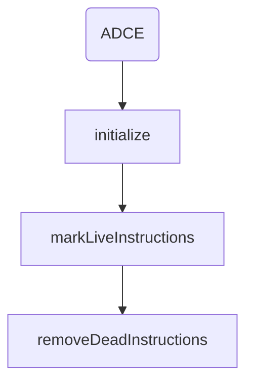
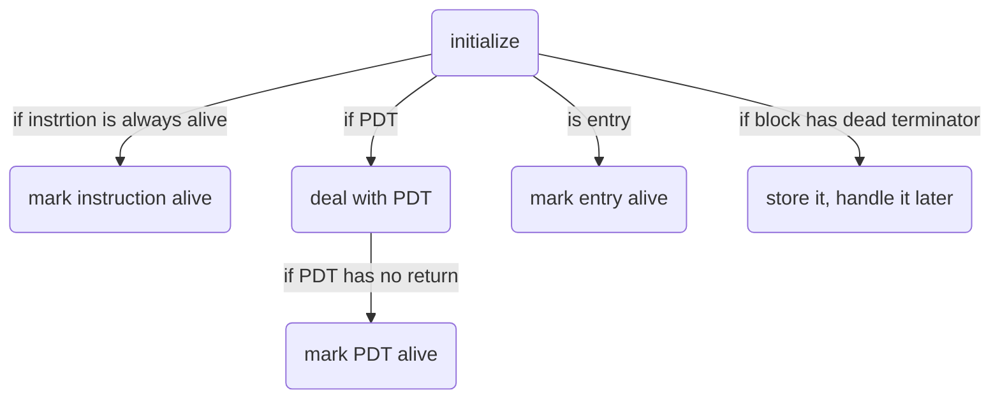
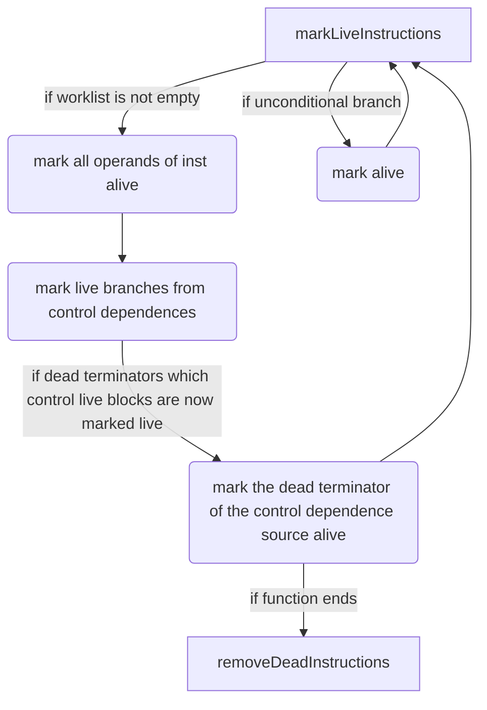
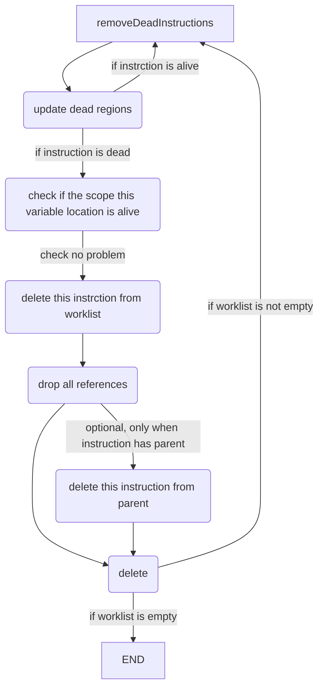

# lab3-2实验报告

李岸宜 PB17111567

王嵘晟 PB17111614

## 实验要求

本实验要求我们阅读理解llvm提供的代码优化方案（也就是pass），并且实际使用这些pass对`.ll`代码进行优化来了解具体的优化流程。

## 报告内容 

### DCE

DCE是一个DeadInstElimination类的子类，它在超类 [dead instruction elimination](http://llvm.org/docs/Passes.html#passes-die)通过简单遍历删除明显死代码的基础上，进一步检查了离开一个函数后后指令是否会在之后变成死代码并进行了删除。

#### ADCE

ADCE是一种更加激进死代码删除方法，它没有其他pass作为超类（直接是FunctionPass的子类）。它默认每条代码都是死代码，然后再从中保留活代码。



代码有三个主要部分，依次执行。

三个部分的示意图如下









#### 代码优化对比

我们用一个简单的程序进行实例。

```c
int FunctionB(int a,int b)
{
    while(a<b)
    {
        b=b-a;
    }
    while(b>10)
    {
        a=a+1;
        b=b-1;
    }
    return a+b-1;
}

int main(void)
{
    int a;
    int c;
    int d;
    int e;
    int f;
    int g;
    c=30;
    d=20;
    e=5;
    if(c>d)
    {
        g=FunctionB(c,d);
    }
    if(e<4)
    {
        g=FunctionB(d,c);
    }
    return 0;
}
```

这个程序的main部分有明显的死代码。

```
%0 = alloca i32
  store i32 0, i32* %0
  %1 = alloca i32
  %2 = alloca i32
  %3 = alloca i32
  %4 = alloca i32
  %5 = alloca i32
  %6 = alloca i32
  store i32 30, i32* %2
  store i32 20, i32* %3
  store i32 5, i32* %4
  %7 = load i32, i32* %2
  %8 = load i32, i32* %3
  %9 = icmp sgt i32 %7, %8
```

优化后得到。

```
%0 = alloca i32
  store i32 0, i32* %0
  %1 = alloca i32
  %2 = alloca i32
  %3 = alloca i32
  %4 = alloca i32
  store i32 30, i32* %1
  store i32 20, i32* %2
  store i32 5, i32* %3
  %5 = load i32, i32* %1
  %6 = load i32, i32* %2
  %7 = icmp sgt i32 %5, %6
```

没有用到的变量声明（死代码被删除）。ADCE和DCE得到了相同优化后代码。在尝试数十个case后，发现了和#248相同的问题：很难找到令两种优化方案产生不同代码的case。  
在用源代码直接生成的LLVM IR中，%1 = alloca  i32 %5 = alloca i32分别代表int a  int f，这显然是死代码，已经被DCE和ADCE删除。


## 实验总结

1. 了解了PASS的工作原理
2. 对于DCE和ADCE删除死代码的机制有了一定的深入理解
3. 对于独立于机器的代码优化有了一定的了解
4. 对于c++代码的阅读与理解能力有了一定的提高

## 实验反馈

1. 官方文档过于简陋阅读起来十分困难，希望助教可以提供一些文档注记以便于理解。
