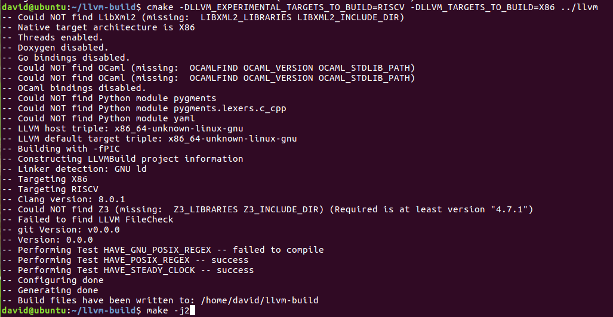
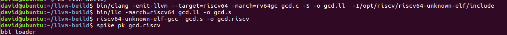
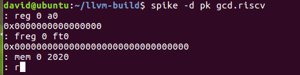
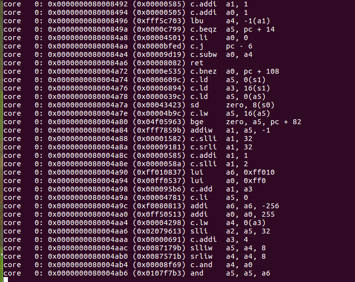

# lab4实验报告

组长 李岸宜 PB17111567

小组成员 王嵘晟 PB17111614

## 实验要求

1. RISC-V 机器代码的生成和运行
配置实验环境，对LLVM 8.0.1 进行配置使其支持RISC-V后端、编译RISCV-tool-chain、spike和pk。
将gcd.c进一步生成为RISC-V源码。
安装模拟器并运行RISC-V源码。
2. LLVM源码阅读与理解
仔细阅读LLVM源码中的代码段，并回答问题
分析总结书上所讲的算法与LLVM源码中的实现之间的不同点，解释一下为什么要有这样的不同。

## 报告内容 

#### 1. RISC-V 机器代码的生成和运行

- LLVM 8.0.1适配RISC-V
由于配置环境是完成实验的第一步，所以我们在实验布置下来后就先进行了配置环境的第一步————让LLVM适配RISC-V。根据助教提供的tutorial，我们踩了很深的坑，重新编译了一遍完整的LLVM源码，导致我们需要不断扩展硬盘，而且编译花了非常多的时间，困扰了我们大概两天也没有最终编译完成。当我们在ISSUE中发现同学给出正确解决方案时，果断选择make clean了之前的错误内容，然后在llvm-build文件夹中实行了增量编译，最终成功解决了这个问题。  

  ......

- lab3-0 GCD样例 LLVM IR 生成 RISC-V源码的过程
一开始我们将gcd样例直接放到lab4文件夹中然后通过clang和llc进行编译，结果发现都是对路径报错，随即发现是没有配置环境变量。于是我们加上了环境变量指向llvm-build，结果发现还是不行，于是直接把gcd.c文件放入了llvm-build文件夹中，最终成功完成了对gcd样例从.c文件到.riscv文件的编译。  

  ......

- 安装 Spike模拟器并运行上述生成的RISC-V源码
安装spike模拟器应该是我们配置环境时踩雷最多的地方，由于一开始的操作失误，我们没有clone github上的仓库，而我们配置的PATH中恰好有configure文件于是整个make过程并没有报错，导致我们make了不知道什么东西……结果当然是没有找到spike可执行文件。好在最后我们发现了这一问题并clone了库，解决了这个问题。最后成功在Spike模拟器上运行了RISC-V源码并且进入了debug模式

  ......

#### 2. LLVM源码阅读与理解

- RegAllocFast.cpp 中的几个问题

  * RegAllocFast* 函数的执行流程？

    答：......

  * *allocateInstruction* 函数有几次扫描过程以及每一次扫描的功能？

    答：......

  * *calcSpillCost* 函数的执行流程？

    答：......

  * *hasTiedOps*，*hasPartialRedefs，hasEarlyClobbers* 变量的作用？

    答：......

- 书上所讲的算法与LLVM源码中的实现之间的不同点

  ......

## 组内讨论内容

......

## 实验总结

此次实验有什么收获

## 实验反馈

对本次实验的建议（可选 不会评分）