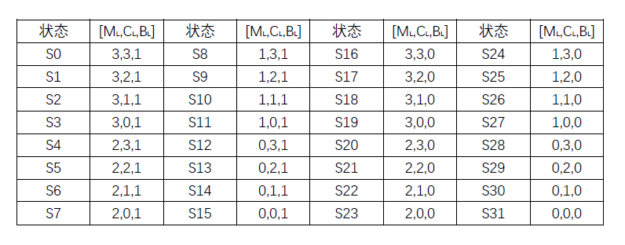
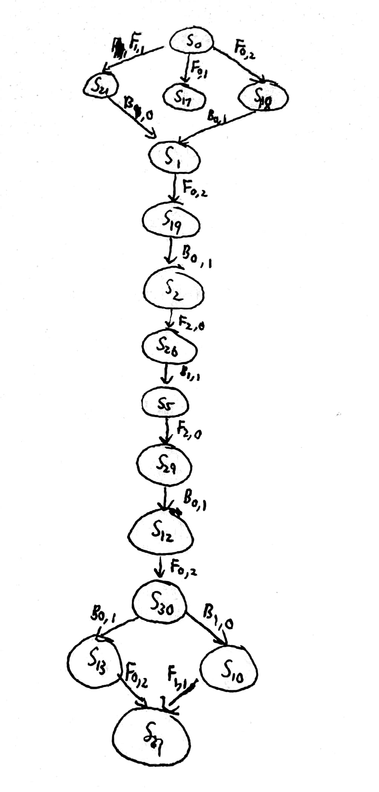
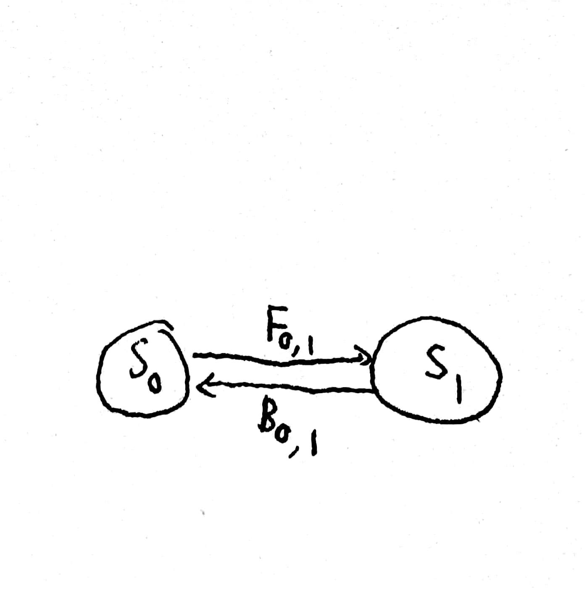

# HW1
## 3.6
### (a)
状态：由Agent的着色状态确定，有五种情况，分别为不着色和着四种不同的颜色。  
初始状态：每个地区都没有着色  
行动：给一个地区选择合适的颜色着色  
转移模型：给当前地区着色的选择受到与之相邻且着好色的地区的制约，需要选择不冲突的颜色  
目标测试：检测是否每个地区都被成功着色且两个相邻的地区着色不相同  
路径消耗：每一步的耗散值为1，整个路径的耗散值是路径中的步数  
### (b)
状态：猴子离地高度  
初始状态：3英尺，即猴子身高    
转移模型：通过6个行动来摘取到香蕉：爬上箱子、爬下箱子、推箱子、堆叠箱子、在地面上平地走、摘香蕉  
目标测试：猴子摘到香蕉  
路径耗散：每一步的耗散值为1，整个路径的耗散值是路径中的步数  
### (d)
状态：用一个三元组[x,y,z]来表示三个水壶中水的量，其中0&le;x&le;12，0&le;y&le;8，0&le;z&le;3  
初始状态：[0,0,0]  
转移模型：三元组[x,y,z]中xyz的值通过直接装水或倒出来得到，或者在壶没有装满的情况下将其中一个壶里的水倒进另一个壶里，比如从[x,y,z]变成[x+y,0,z]，前提是x+y&le;12  
目标测试：[1,y,z]或[x,1,z]或[x,y,1]  
路径耗散：每一步的耗散值为1，整个路径的耗散值是路径中的步数  
## 3.9
### (a)
状态：用一个三元组来表示左岸的状态传教士人数、野人人数、船的位置：[M<sub>L</sub>,C<sub>L</sub>,B<sub>L</sub>]，其中0&le;M<sub>L</sub>,C<sub>L</sub>&le;3，0&le;B<sub>L</sub>&le;1。[3,3,1]表示左岸有三个传教士三个野人船在左岸  
初始状态：[3，3，1]  
转移模型：将1个或2个人以及船从一个岸边转移到另一个岸边  
目标测试：[0,0,0]可行，[0,0,1]达不到  
路径耗散：每一步的耗散值为1，整个路径的耗散值是路径中的步数  
状态空间：  
  
当一条船能载两个人时：可达且符合要求的状态一共有16个：S0 S1 S2 S5 S10 S12 S13 S14 S17 S18 S19 S21 S26 S29 S30 S31  
这时船上[M,C]组合为[2,0] [1,1] [1,0] [0,1] [0,2]五种情况。
用F<sub>i,j</sub>来表示从左向右即过河方向划船，[M,C]组合为[i,j],B<sub>i,j</sub>来表示从右向左即过河相反方向划船，[M,C]组合为[i,j]。
所以最终的状态空间图：  
  
当一条船上只能载一个人时，可达且符合要求的状态一共有2个：S0 S1
最终的状态空间图：
   
### (b)
使用广度优先搜索可以求出该问题的最优解，其最优解情况如上图状态空间图所示。除了初始状态和最终状态，路径选择是唯一的。所以不需要检查重复状态  
伪代码如下：  
```
//首先构造32个顶点：
void CreateVertex()
{
    for i from 3 to 0
        for j from 3 to 0
            new Vertex(i,j,1);
            new Vertex(i,j,0);
    return Vertex;
}
//构造小船，Capacity表示小船最大载客量，Forward表示向对岸划船，Back表示返回原岸：
int Boat(int Capacity)
{
    for i from 0 to Capacity
        for j from 0 to Capacity-i
            int Forward = Vertex(-i,-j,-1);
            int Back = Vertex(i,j,1);
    return Forward,Back;
}
//判等条件，任何位置不允许野人人数大于传教士人数:
bool Judgement1(m,c)           //m,c左岸传教士和野人数量
{
    if((m == 3) && (0 < c <= 3))
        return true;
    else if(m == c)
        return true;
    else if((m == 0) && (0< c <= 3))
        return true;
    return false;
}
bool Judgement2(m,c)         //m,c表示左岸上传教士和野人的数量
{
    if((m == 3) && (0 <= c < 3))
        return true;
    else if(m == c)
        return true;
    else if((m == 0) && (0 <= c < 3))
        return true;
    return false;
}
bool Position = The boat is on the left?  //船在左岸--1，右岸--0
bool Accept = ((Judgement1 && Position) || (Judgement2 && !Position));           //最终判得的可行顶点Vertex满足的条件
//过河：
void Cross()
{
    Vertex = Vertex + Forward;   //从左向右
    Vertex = Vertex + Back;      //从右向左
}
从初始状态Vertex(3,3,1)开始循环运行Cross，到达一个新的Vertex先计算Accept来判断是否为可行的Vertex。以此来完整判断第一层广度优先搜索中一共有几个可行的Vertex。  
接下来对每个可行的Vertex继续循环运行Cross，直到得到最终状态Vertex(0,0,0)为止。广度优先搜索最终搜索到第11层找到正确方案。
```
### (c)
困难点在于并不是每个状态都是可达的或者合法的且可达性与合法性并不是那么直观。这就导致了在每个状态都有种可能会有很多分支的感觉导致感觉上求解困难  
