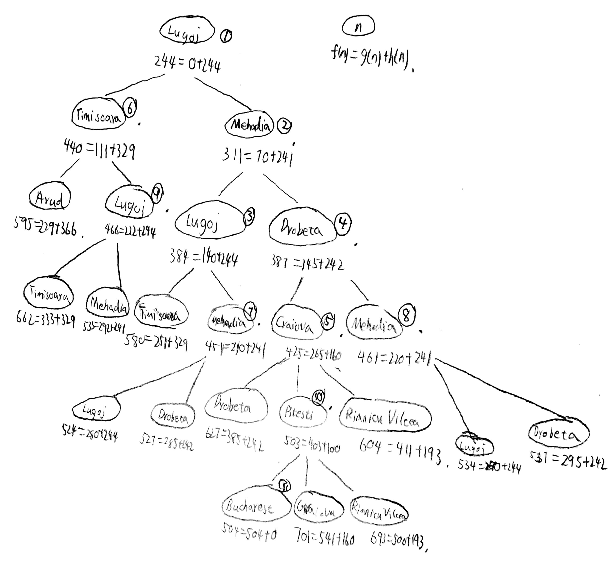
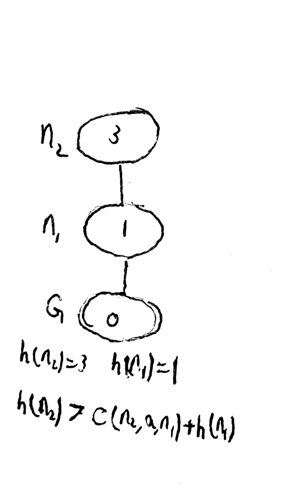

# HW2
## 3.23
  
## 3.25
由于启发式路径算法的评估函数f(n)=(2-&omega;)g(n)+&omega;h(n)，所以当0&le;&omega;&le;2时，该式子都是成立的，因而此时启发式路径算法完备。根据均值不等式，当(2-&omega;)g(n)=&omega;h(n)时，f(n)最小。所以&omega;=$2g(n)\over g(n)+h(n)$即对于不同的n而言，&omega;的值做相应变化使得算法最优。当&omega;=0时，f(n)=2g(n)，这时属于代价一致搜索算法。当&omega;=1时，f(n)=g(n)+h(n)，是A*算法。当&omega;=2时，f(n)=2h(n)，是贪心最佳优先搜索算法。  
## 3.28
&emsp;&emsp;用h=h1+h2来作为启发式函数，它在八数码问题中有时会估计过高。当此启发式函数对于最优路径上的结点估计过高时，会导致产生非最优解，即可能是次优解。  
&emsp;&emsp;考虑在八数码边界上的最优路径上的结点n，由于h被高估的部分不超过c，所以由A* 算法，f(n)=g(n)+h(n) &le; C* +c成立，即此时A*算法返回的解代价比最优解代价多出的部分不会超过c。  
&emsp;&emsp;假设次优结点G2在边界上，假设G2被高估部分超过c，即g(G2) &gt; C\*+ c，这时对于任意一个结点n来说：
$$f(n)=g(n)+h(n)\\
\qquad \qquad \le g(n)+h^{*}(n)+c\\
\le C^{*}+c\\
\lt g(G_{2})$$
&emsp;&emsp;显然最优解扩展前不能扩展G2，因此对于任何一个结点，h被高估的部分不超过c，A\*算法返回的解代价比最优解代价多出来的部分也不超过c。
## 3.29
&emsp;&emsp;由数学归纳法：当启发式是一致的时，h(n)&le;c(n,a,n')+h(n')。令G为目标结点，则h(G)=0，h(n)&le;c(n,a,G)+0成立，这时是可采纳的。假设距离目标结点G为k的结点nk，满足A\*的定义且是可采纳的，则对距离为k+1的结点nk+1：  
$$h(n_{k+1})\le c(n_{k+1},a,n_{k})+h(n_{k})$$
由于  
$$h(n_{k}) \le h^{*}(n_{k})$$
所以  
$$h(n_{k+1}) \le h^{*}(n_{k+1})$$  
对于距离目标结点G为k+1的结点nk+1，满足A\*的定义且是可采纳的。所以启发式是一致的则一定可采纳得证。  
非一致的可采纳启发式：  

## 6.5
&emsp;&emsp;首先选取变量X3的值，X3的值域为{0,1}。由于X3=F，F$\neq$0，所以X3=1。这时对于F，取值只能是F=1。选择变量X2，对于前向检验，X2的取值范围{0,1}都可以取到。所以这时候令X2=0，则X1有最小约束值。选取X1的值为0，所以由于 $O+O=R+10*X_{1}$ 且 $X_{2}+T+T=O+10*X_{3}$，说明O必须为偶数，且取值小于等于4，所以令O=4，则R、T都有唯一取值，R=8，T=7。由于$X_{2}+W+W=U+10*X_{3}$，可见U是一个小于9的偶数，由于约束性，U只能取值为6，W=3。这时完成求解密码算术问题。F=1 T=7 U=6 W=3 R=8 O=4 X1=0 X2=0 X3=1。
## 6.11
&emsp;&emsp;当{WA=red,V=blue}时，对于AC3算法中while循环的每次迭代做检验：  
&emsp;&emsp;&emsp;Remove SA-WA,删除SA的red;  
&emsp;&emsp;&emsp;Remove SA-V,删除SA的blue,所以SA着色green；  
&emsp;&emsp;&emsp;Remove NT-WA,删除NT的red;  
&emsp;&emsp;&emsp;Remove NT-SA,删除NT的green,所以NT着色blue；  
&emsp;&emsp;&emsp;Remove NSW-SA,删除NSW的green；  
&emsp;&emsp;&emsp;Remove NSW-V,删除NSW的blue,所以NSW着色red；  
&emsp;&emsp;&emsp;Remove Q-NT,删除Q的blue；  
&emsp;&emsp;&emsp;Remove Q-SA,删除Q的green；  
&emsp;&emsp;&emsp;Remove Q-NSW,删除Q的red,此时Q无法用三种颜色中任意一种着色，说明原赋值不相容。  
## 6.12
&emsp;&emsp;在树结构的CSP中，设变量最大值域为d个元素，二元约束即弧数为c等于树的边数，则由于树的性质，AC3算法最坏情况下的时间复杂度为O(dc)。