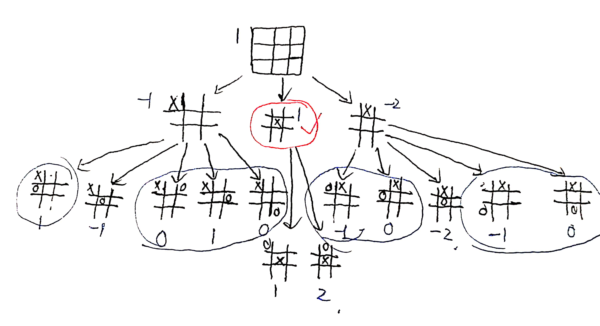
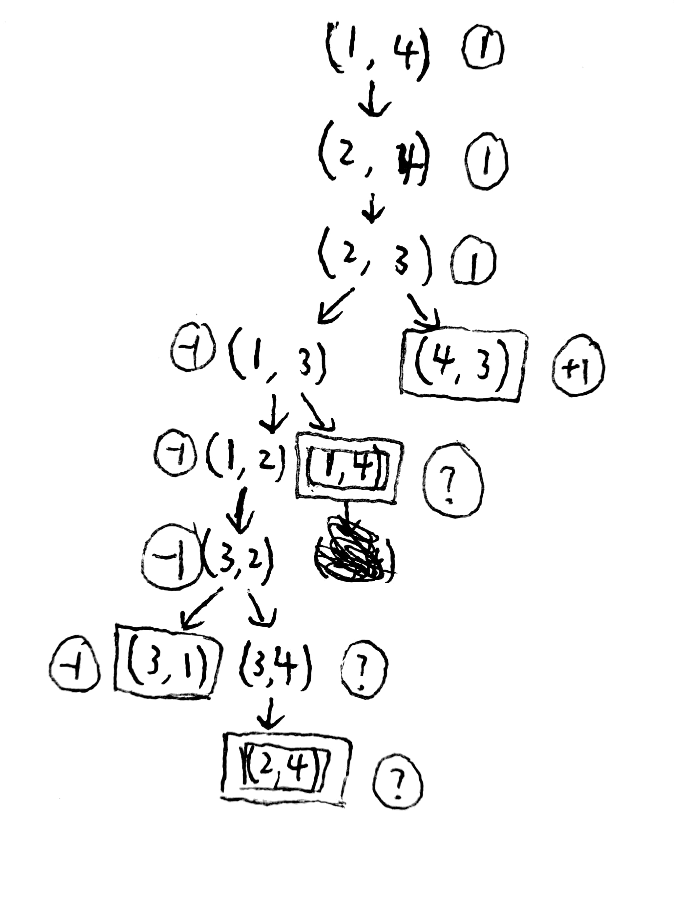

# HW3
## 5.9
### a
>9!
### b c d e

>红笔标注的为最佳起始行棋
## 5.8
### a

>其中画双方框的为循环状态
### b
>标记结果如上图所示，对于"?"，由于"?"的取值无非是-1或+1。所以min(?,-1)=-1，max(?,1)=1。当一个结点的所有后继结点的博弈值都是"?"时，它的博弈值也是"?"。
### c
>由于标准的极小极大算法是深度优先的，在这棵博弈树中由于存在循环状态，会导致极大极小算法进入死循环。极大极小算法将经历过的状态压入了栈里，当算法处理一个状态时，可以先通过搜索栈中存储的状态来看是否有重复。如果是重复状态则说明该状态是循环状态，直接返回一个"?"，这样递归可以正常执行。不是对所有包含循环的游戏都能给出最优决策，因为这个模型评估函数值只有-1和+1才可以这么处理。
### d
>当n=3时，由于A先走，A到2，B到1，B一定会赢。n=4时，由上图博弈树可知A一定会赢。令$k\in \mathbb{N}$，当n=2k时，A要赢需要走n-2步，而B需要走n-1步，在中间会是A翻过B，所以A一定会赢。当n=2k+1时，A要赢需要走n-1步，而B需要走n-2步，在中间会是B翻过A，所以B一定会赢。所以n是偶数A一定赢，n是奇数A一定输。
## 5.13
### a
>n2=max(n3,n31,...,n3b3) 
>n1=min(max(n3,n31,...,n3b3),n21,...n2b2 ) 
>nj-1=min(nj,nj1,...,njbj ) 
>所以n1=min(max(...max(min(nj,nj1,...,njbj ),nj-1&ensp; 1,nj-1&ensp; 2,...,nj-1&ensp; bj-1 ),nj-2&ensp; 1,nj-2&ensp; 2...nj-2&ensp; bj-2... ),n21,...n2b2) 
### b
>n1=min(l2,n2,r2 ) 
>...
>n1=min(l2,max(l3,...,min(lj,nj,rj),...r3 ),r2 ) 
### c
>由于nj是一个MAX结点，所以只有当它的后继结点被评估时它的值的下界才会增长。而如果nj的值比lj 大，则由于nj-1=min(lj,nj,rj ) ，递推下去nj无法对n1施加影响。所以nj不能超过由lj值得到的某特定界限
### d
>由于nj是一个MIN结点，所以只有当它的后继结点被评估时它的值的上界才会减小。而如果nj的值比lj 小，则由于nj-1=max(lj,nj,rj ) ，递推下去nj无法对n1施加影响。所以nj不能小于由lj值得到的某特定界限