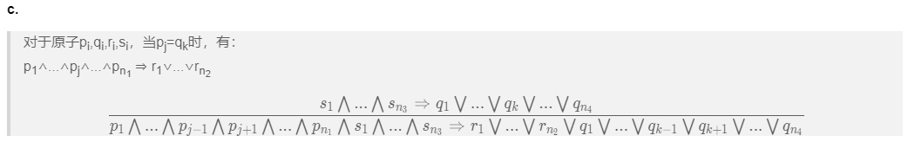

# HW4
## PB17111614 王嵘晟
#### 7.13
##### a.
>对于语句P&rArr;Q，其等价于&not;P&or;Q  
>所以(P1&and;...&and;Pm)&rArr;Q &hArr; &not;(P1&and;...&and;Pm)&or;Q  
>由(P1&and;...&and;Pm)&hArr;(&not;P1&or;...&or;&not;Pm)   &emsp;(摩根率)  
>所以(&not;P1&or;...&or;&not;Pm&and;Q) &hArr; (P1&and;...&and;Pm)&rArr;Q  
##### b.
>在一个子句中，可以将正文字写作P1,P2,...,Pm，负文字写作Q1,Q2,...,Qn当这个子句写成(&not;P1&or;...&or;&not;Pm&or;Q1&or;...&or;Qn)时，其等价于(P1&and;...&and;Pm)&rArr;(Q1&or;...&or;Qn)，原命题得证。
##### c.
>对于原子pi,qi,ri,si，当pj=qk时，有：  
>p1&and;...&and;pj&and;...&and;pn1 &rArr; r1&or;...&or;rn2  
>$$\frac{s_{1}\bigwedge ... \bigwedge s_{n_{3}} \Rightarrow q_{1}\bigvee ...\bigvee q_{k}\bigvee ...\bigvee q_{n_{4}} }{p_{1}\bigwedge ...\bigwedge p_{j-1}\bigwedge p_{j+1}\bigwedge... \bigwedge p_{n_{1}}\bigwedge s_{1}\bigwedge ... \bigwedge s_{n_{3}} \Rightarrow r_{1}\bigvee...\bigvee r_{n_{2}} \bigvee q_{1}\bigvee ...\bigvee q_{k-1}\bigvee q_{k+1}\bigvee ...\bigvee q_{n_{4}} } $$  

Latex转码失败…，放一张Preview的图：  
  
#### 证明前向链接算法的完备性：
>考察inferred表的最终状态，在算法到达不动点以后，不会再出现新的推理。该表把推导出的每个符号设为true，其他符号为false。可以把此表看作一个逻辑模型；而且原始KB中的每个限定子句在该模型中都为真。假设相反情况成立，即某个字句a1&and;...&and;ak&rArr;b在此模型下为假。那么a1&and;...&and;ak在模型中必须为真，b必须为假。这与假设的算法已经达到一个不动点相矛盾。因而可以得出结论在不动点推导出的原子语句集定义了原始KB的一个模型。更进一步被KB蕴涵的任一原子语句q在它的所有模型中为真，尤其是这个模型。因此每个被蕴涵的语句q必定会被算法推导出来。所以前向链接算法是完备的。