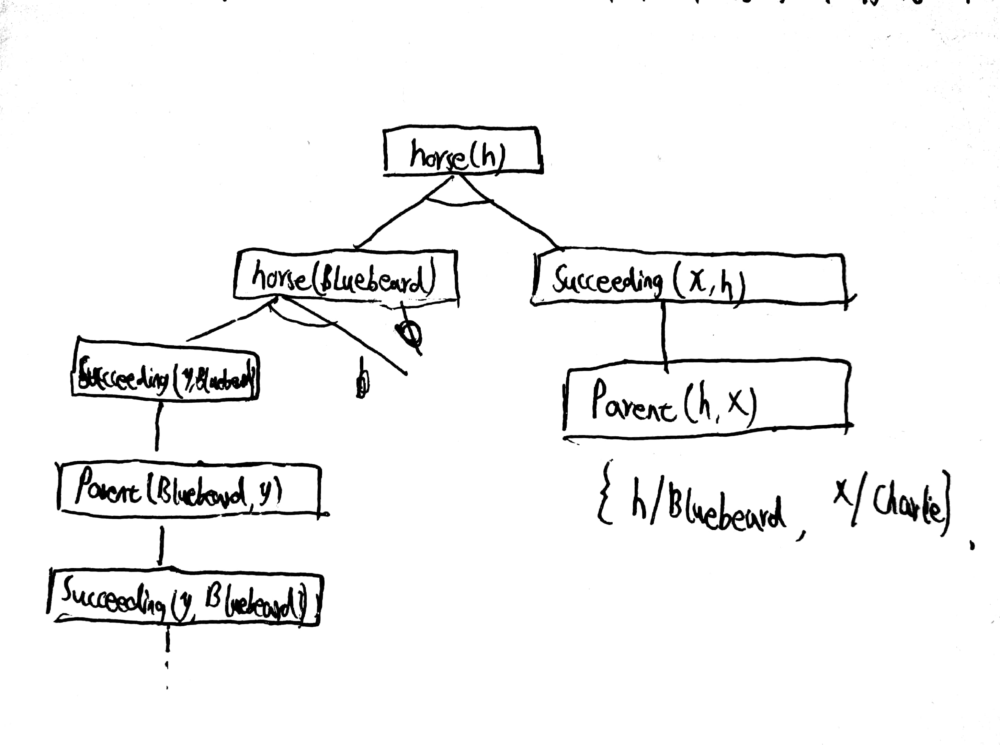

# HW5
## 8.24
### a ~ d
>定义:   
>>Student(x)&emsp; 表示学生x  
Take(student, course, semester)&emsp; 表示学生student在学期semester上过课程course  
Pass(student, course, semester)&emsp; 表示学生student在学期semester通过了课程course    
Score(student, course, semester)&emsp; 表示学生student在学期semester学习课程course的得分  
#### a.
>&exist;x&emsp; Student(x) &and; Take(x, French, 2001Spring)
#### b.
>&exist;x,s&emsp; Student(x) &and; Take(x, French, s) &Rightarrow; Pass(x, French, s)
#### c.
>$\exists x\  Student(x) \land Take(x,\ Greek,\ 2001Spring) \land \forall y\ y\not ={x}\ \  \Rightarrow \ \neg Take(y,\ Greek,\ 2001Spring)  $
#### d.
>$\forall y,s\ \exists x\ \  Score(x,\ Greek,\ s)>Score(y,\ French,\ s) $
### e ~ g.
>定义： 
>>Buy(x, y, z)&emsp; x从z那买了y  
Sell(x, y, z)&emsp; x把y卖给z  
Person(x)&emsp; 一个人x  
Agent(x)&emsp; 代理人x  
Insurance(x)&emsp; 保险x  
Smart(x)&emsp; x是聪明的  
Insured(x)&emsp; x投保了  
Expensive(x)&emsp; x是昂贵的
#### e.
>$\forall x\ Person(x)\ \land \ (\exists \ y,z\ Insurance(y)\ \land \ Buy(x,\ y,\ z))\ \Rightarrow \ Smart(x) $
#### f.
>$\forall x,y,z\ Person(x)\ \land \ Insurance(y)\ \land \ Expensive(y)\ \Rightarrow \ \neg Buy(x,\ y,\ z) $
#### g.
>$\exists x\ \forall y,z\ Agent(x)\ \land \ Insurance(y)\ \land \ Sell(x,\ y,\ z)\ \Rightarrow \ (Person(z)\ \land \  \neg Insured(z)) $
#### h.
>定义： 
>>Barber(x)&emsp; x是理发师  
  Shave(x, y)&emsp; y给x刮胡子  
  Person(x)&emsp; x表示一个人
>>$\exists x\ \forall y\ \ Barber(x)\ \land \ Person(y)\  \land \ \neg Shave(y,\ y)\ \Rightarrow \ Shave(x,\ y) $
### i ~ j
>定义：
>>Person(x)&emsp; 一个人x   
Born(x, c)&emsp; x出生在c  
Parent(x, y)&emsp; x为y的双亲之一  
Civil(x, c, w)&emsp; x通过方式w成为c的公民  
Resident(x, c)&emsp; x是c的永久居住者  
birth&emsp; 表示出生   
bond&emsp; 表示血统关系   
#### i.
>$\forall x\ Person(x)\ \land \ Born(x,\ UK)\ \land \ (\forall y\ Parent(y,\ x)\ \Rightarrow \ (\exists r\ Civil(y,\ UK,\ r)\ \vee \ Resident(y,\ UK)))\ \Rightarrow \ Civil(x,\ UK,\ birth) $
#### j.
>$\forall x\ Person(x)\ \land \ \neg Born(x,\ UK)\ \land \ (\exists y\ Parent(y,\ x)\ \land \ Civil(y,\ UK,\ birth))\ \Rightarrow \ Civil(x,\ UK,\ bond) $
#### k.
>定义：
>>Person(x)&emsp; 一个人x  
Politician(x)&emsp; 政治家x  
Fool(x, y, t)&emsp; y在时间t愚弄x   
>>$\forall x\ Politician(x)\ \Rightarrow \ ((\exists y\ \forall t\ Person(y)\ \land \ Fool(y,\ x,\ t))\ \land \ (\forall y\ \exists t\ Person(y)\ \land \ Fool(y,\ x,\ t))\ \land \ \neg(\forall y\ \forall t\ Person(y)\ \land \ Fool(y,\ x,\ t)) )$
## 8.17
>首先没有考虑边界问题，例如当[x, y]为最右边方格时，[x+1, y]不存在，当[x, y]为最上面方格时，[x, y+1]不存在  
另外只能表示右边和上边的邻居，没法表示左边和下边的邻居  
邻居的表示没有交换性，Adjacent([1,1],[2,1])是对的但没法说明Adjacent([2,1],[1,1])也是对的  
不具有完备性，无法说明不满足这个条件的点都不是邻居
## 9.3
>b,c
## 9.4
### a.
>{x/A, y/B, z/B}
### b.
>不存在，x不能同时置换A、B
### c. 
>{x/John, x/John}
### d.
>不存在，x不能置换y
## 9.6
### a.
>Horse(x) &Rightarrow; Mammal(x)  
Cow(x) &Rightarrow; Mammal(x)  
Pig(x) &Rightarrow; Mammal(x)
### b.
>Succeeding(x, y)&emsp; 表示x是y的后代  
Succeeding(x, y) &and; Horse(y) &Rightarrow; Hourse(x)
### c.
>Horse(Bluebeard)
### d.
>Parent(x, y)&emsp; 表示x是y的家长  
Prent(Bluebeard, Charlie)
### e.
>Parent(x, y) &Rightarrow; Succeeding(y, x)  
Succeeding(x, y) &Rightarrow; Parent(y, x)
### f.
>Mammal(x) &Rightarrow; &exist;y Parent(y, x)
## 9.13
### a.

### b.
>由于Succeeding和Parent是逆关系，这样会产生一个无限循环。另外Succeeding(x, y) &and; Horse(y) &Rightarrow; Horse(x)也可以单独产生无限循环。
### c.
>两个，h的解为Bluebeard何Charlie