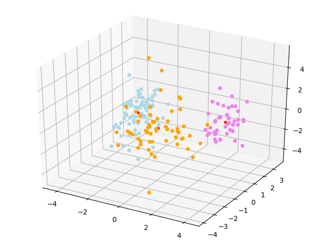
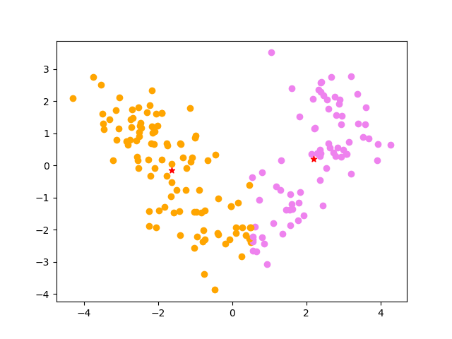

# 非监督学习实验报告
王嵘晟  
PB17111614
## 1. 运行方法
环境： Python 3.7.6  
main.py 完成了对数据集的读取和预处理，同时在主函数中调用了 PCA,KMeans 这两个个类。此程序为命令行程序，在命令行中运行输出结果。输出结果文件分为3个 csv 文件，分别表示被分号的3类数据
## 2. 数据集预处理
在 main.py 中，我对数据集进行了读取并处理操作。首先对于数据集的第一列，类比1，2，3我更改成0，1，2。然后对于剩余的数据做了类似零均值的处理，即将 data 的每一元减去平均值再除以标准差（类似正态分布）
## 3. PCA
### 算法思想：
- 将原始数据按列组成 n 行 m 列矩阵 X
- 将X的每一行（代表一个属性字段）进行零均值化，即减去这一行的均值
- 求出协方差矩阵
  C=1/mXXT
- 求出协方差矩阵的特征值及对应的特征向量
- 将特征向量按对应特征值大小从上到下按行排列成矩阵，取前k行组成矩阵 P
- Y=PX 即为降维到k维后的数据

具体实现过程在代码中已经贴出注释
## 4. KMeans
### 算法思想：
- 从 N 个数据样本随机选取K个数据文档作为聚类中心
- 对每个数据文档测量其到每个聚类中心的距离，并把它归到最近的聚类中心的类。
- 重新计算已经得到的各个类的聚类中心。
- 迭代第二步和第三步直至新的聚类与原聚类中心距离小于指定阈值，算法结束。

距离计算全部使用欧氏距离，具体实现过程在代码中已经贴出注释
## 5. 实验结果分析
### 对 PCA 使用不同的 threshold 降维：
当 threshold 小于一定的值时返回的是零维，所以从0.4开始
| threshold | 降维结果（维度） | RI | S |
| :-------: | :-------------: | :-: | :-: |
| 0.4 | 2 | 0.776 | 0.217 |
| 0.5 | 2 | 0.851 | 0.246 |
| 0.6 | 3 | 0.911 | 0.280 |
| 0.7 | 4 | 0.756 | 0.183 |
| 0.8 | 5 | 0.899 | 0.269 |
| 0.9 | 8 | 0.857 | 0.239 |
结论：  
- 随着 threshold 的增加， 兰德系数和轮廓系数有一定的提升
- 在 threshold=0.6，取3个主成分时效果最好，可见主成分有时会把一些干扰因素引入，而这些干扰因素使得两个系数降低
### 对 PCA 降维到不同的维度：
| Dimension | RI | S |
| :-------: | :-: | :-: |
| 2 | 0.718 | 0.251 |
| 3 | 0.714 | 0.112 |
| 4 | 0.888 | 0.163 |
| 5 | 0.820 | 0.152 |
| 6 | 0.814 | 0.109 |
| 7 | 0.829 | 0.135 |
| 8 | 0.790 | 0.097 |
| 9 | 0.794 | 0.147 |
| 10 | 0.795 | 0.116 |
| 11 | 0.783 | 0.090 |
| 12 | 0.764 | 0.085 |
| 13 | 0.767 | 0.062 |
结论：  
- 随着目标维度的增加，兰德系数的变化并不是很明显，但轮廓系数有明显的减少
- 原因应该是根据轮廓系数的定义，随着维度的增加，a(i)与b(i)的值越来越趋近。
### 使用 PCA 降维与不使用 PCA 降维比较：
这里选定降维到 K=3  
降维前：  
RI=0.660, S=0.104   
降维后：  
RI=0.874, S=0.266  
结论：使用 PCA 降维后的结果显然要比不用 PCA 降维要好，原因应该是降维剔除的主属性对于分类的判别属于噪声干扰。
### 可视化生成图：
对于 K=3, 降维到3维后使用 KMeans 算法做划分，得到的结果如图：  
  
对于 K=2， 降维到2维后用 KMeans 算法做划分，得到结果如图：  
