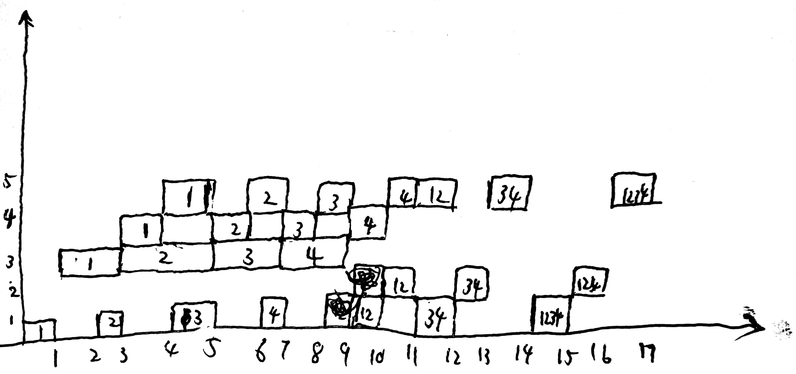

# HW2
### PB17111614 王嵘晟
#### 1.
##### (a)
>从1到2的对于R1的RAW相关  
>从1到3的对于R1的RAW相关  
>从2到3的对于R1的RAW相关  
>从4到5的对于R2的RAW相关  
>从5到6的对于R4的RAW相关
##### (b)
```
指令    1   2   3   4   5   6   7   8   9   10  11  12  13  14  15  16  17  18 
LD      IF  ID  EX  M   WB
DADDI       IF  S   S   ID  EX  M   WB
SD                      IF  S   S   ID  EX  M   WB
DADDI                               IF  ID  EX  M   WB
DSUB                                    IF  S   S   ID  EX  M   WB
BNEZ                                                IF  S   S   ID  EX  M   WB                                                                      
```
>总循环次数为99次，该指令序列在给定的流水线中执行一次循环需要18个时钟周期，但由于流水线冲刷需要2个时钟周期的等待，所以共20个周期。所以总时钟周期为98*19+20=1882
##### (c)
```
指令    1   2   3   4   5   6   7   8   9   10  11  12  13  14 
LD      IF  ID  EX  M   WB
DADDI       IF  ID  S   EX  M   WB
SD              IF  S   ID  EX  M   WB
DADDI                   IF  ID  EX  M   WB
DSUB                        IF  ID  EX  M   WB
BNEZ                            IF  ID  EX  M   WB
LD                                  IF  missmissIF  ID  EX  M   WB
```
>总循环次数99次，该指令序列在给定的流水线中执行一次循环需要11个时钟周期。总时间周期为98*10+11=991
##### (d)
```
指令    1   2   3   4   5   6   7   8   9   10  11  12  13  14 
LD      IF  ID  EX  M   WB
DADDI       IF  ID  S   EX  M   WB
SD              IF  S   ID  EX  M   WB
DADDI                   IF  ID  EX  M   WB
DSUB                        IF  ID  EX  M   WB
BNEZ                            IF  ID  EX  M   WB
LD                                  IF  ID  EX  M   WB
```
总循环次数99次，该指令序列在给定的流水线中执行一次循环需要11个时钟周期。总时间周期98*7+11=704
#### 2.
>先计算A<sub>i</sub>+B<sub>i</sub>，然后计算乘积

  
>在17个&Delta;t时间内得到了7个结果，所以TP=7/17&Delta;t  
>不用流水线时，求和5&Delta;t，求积3&Delta;t。所以总时间29&Delta;t，加速比29/17≈1.71  
>效率=(4*5+3*3)/(5*17)≈34.12%  
#### 3.
##### (a).
>仅考虑数据相关，不考虑分支时：假设执行N条指令，则5级流水线执行了0.2N次stall，总周期为1.2N+4     
>12级流水线执行了0.375N次stall，总时间为1.375N+11，所以加速比为(1.2N+4)\*1/(1.375N+11)\*0.6当N足够大时，加速比为1.45  
##### (b).
>仍旧以N条指令考虑： 则分支有0.2N条，预测错误条数为0.2N\*5%=0.01N，所以引入分支预测错误后，5级流水线执行周期为1.2N+4+0.01N\*2=1.22N+4, CPI=1.22  
>12级流水线执行周期1.375N+11+0.01N\*5=1.425N+11, CPI=1.425