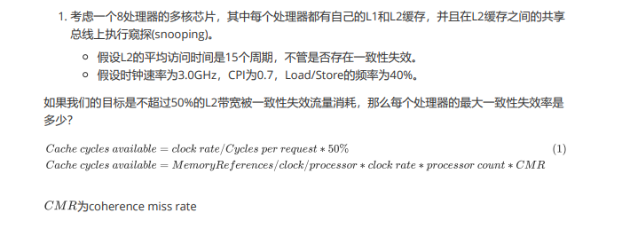

# 随堂测验 5.21
## PB17111614
## 王嵘晟
### 1.
  
Cache cycles available = 3.0GHz/15\*0.5=0.1 GHz  
Cache cycles available = 0.4/0.7\*3.0GHz\*8\*CMR  
所以 CMR = 0.73%
### 2.
#### (1).计算机体系架构中 Coherence 与 Consistency 的区别?
序问题：  
Consistency: 关注不同处理器发出的所有存储器操作的顺序问题，针对不同存储单元或相同存储单元，是访问所有存储单元的全序问题  
Coherence: 关注不同处理器访问相同存储单元时的访问顺序问题，是访问每个Cache块的局部序问题
#### (2).对于共享cache，组相联度少于核的数量或者共享该cache的线程数，会发生什么问题？
Miss的概率会上升，导致访存时间增大