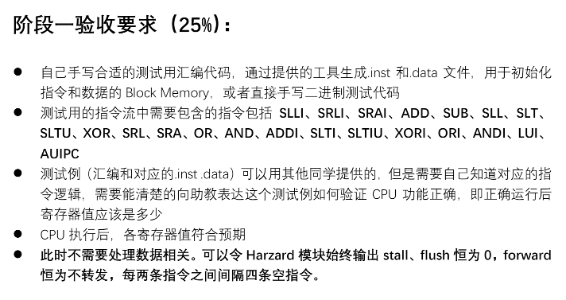
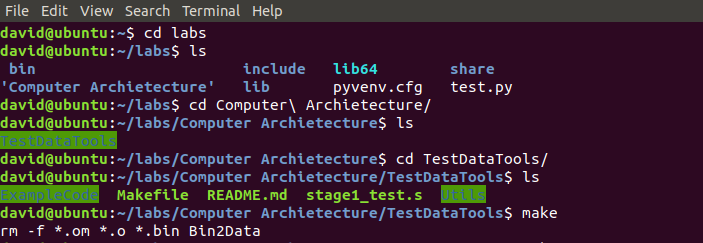
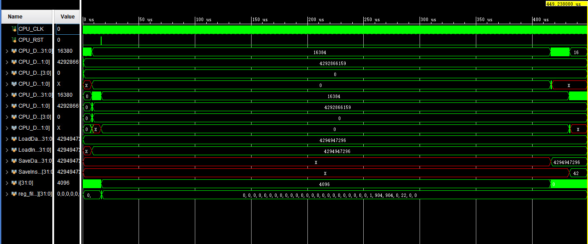
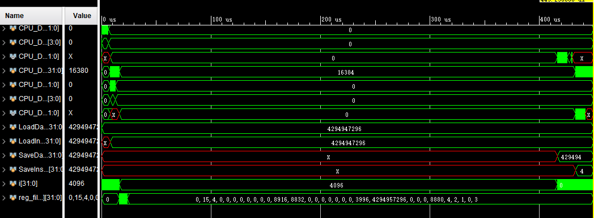
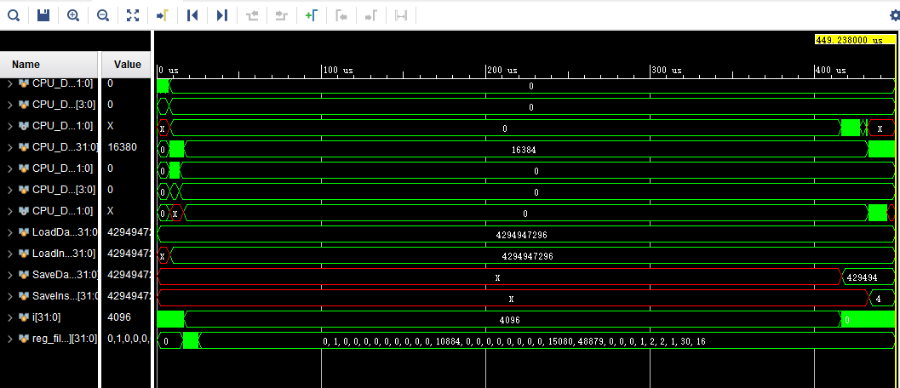
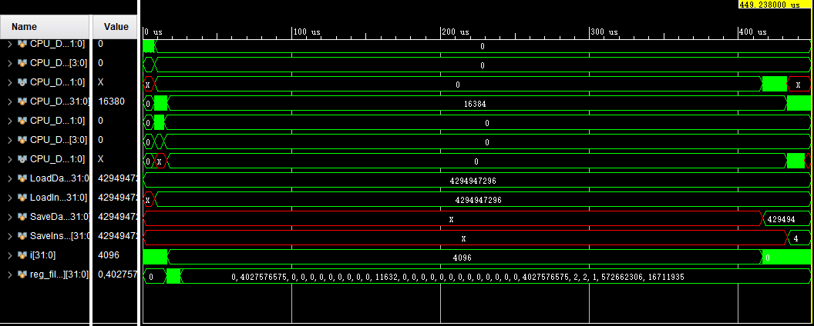

# RV32I PIPELINE CPU Implement Report
### Author: PB17111614 王嵘晟
## 1.实验目标
- 设计一个基于 RV32I 指令的流水线 CPU，并在其中实现CSR指令。  
- 编写测试文件对于 CPU 进行仿真，并根据寄存器结果来判断仿真结果是否正确  
- 使用提供好的大体框架，适当增加或修改数据通路以完成设计
## 2.实验环境&工具
- Windows 10 系统下，Xlinx Vivado 2018.2 作为框架搭建环境
- Visual Studio Code 作为代码编写环境
## 3.实验内容与过程
### 阶段一
- 要求：  
  
- 提供的工具在我的电脑上出现了不知名问题，导致自己编写的文件无法生成出来，Ubuntu 系统下命令行执行结果如下：  
  
- 使用了其他同学的测试文件，测试文件成功执行后，general register中3号寄存器的值应该是22，仿真结果如下：  
  
说明阶段一完成，在不考虑hazard的情况下 CPU 可以正常运行
### 阶段二
- 这时需要考虑冲突，而数据冲突主要是由于RAW引起的，所以需要进行数据转发，适当地从 MEM 和 WB 转发到 ID 阶段的寄存器。此外，对于分支语句，需要对流水线做好 stall 和 flush。
- 解决数据冲突，需要综合考虑reg2_srcE, reg_dstM, reg_write_en_MEM, reg_dstM等信号，改变op1_sel, op2_sel, reg2_sel的值以完成转发。
- 对于分支指令，默认不跳转，但需要进行跳转时将跳转时流水线中的指令全部 flush 掉，不过 flushF, flushM, flushW 没有用到。
- 仿真截图：
- (1). 1testAll: 
  
- (2). 2testAll:
  
- (3). 3testAll:
  
### 阶段三
- 增加了数据通路: CSR 寄存器，并增加信号线 csr_data,csr_func, csr_addr, csr_data_out, 分别表示写入 CSR 寄存器的数据， CSR 指令类型， CSR 地址，从 CSR 寄存器读出的数据。
- 除了新增一个模块以及对 RV32ICore 顶层模块的修改以外，为了合理地解决转发冲突，在 ID/EX, EX/MEM, MEM/WB 段间控制寄存器中增加相应的 CSR 控制信号存储，以达到解决冲突。
- 由于目前 CSR 仿真结果与预想还有些许出入，正在进行修改。所以在此就不贴出仿真结果图了，对于阶段三的完成情况待验收时而定。
## 4.实验总结
在本次实验中遇到的问题有：
- 给出的测试数据生成工具无法正常使用，且没找到成功的解决方法
- 由于有接近一年的时间没有写 verilog 代码，编码生疏，语法错误不断
- Controller Decoder 在编写时没有理清逻辑，导致出现了难以发现的 bug，debug 花费了相当长的时间。
时间分配：
- 阅读实验要求，阅读代码框架，并根据 lab1 编写的实验报告做初步设计————大于3个小时
- 编写代码，完成阶段一 CPU 模块内部逻辑实现————写了一天半，净时间7个小时
- 完成阶段二，加入 hazard 模块————由于这里检测出 bug，陆陆续续用了4天做修改
- 实现对 CSR 的支持————现在还有些问题，到目前为止3个小时
- 实验报告的编写————写到现在1.5小时  

收获：
- 对于 RV32I CPU的搭建有了更深刻的了解与认识
- 对于 verilog 代码编写以及 Vivado 仿真功能的使用有了深入实践
## 改进意见
- 给出代码框架希望对于信号的注释更加清楚一些，有些信号功能不明确
