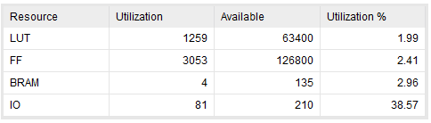
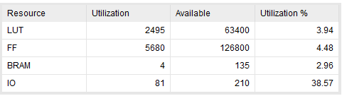
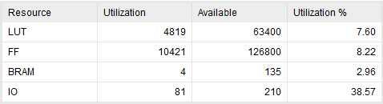
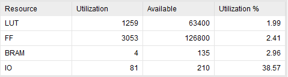
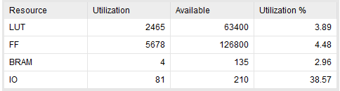
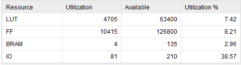
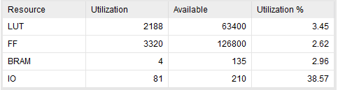
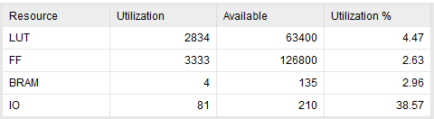
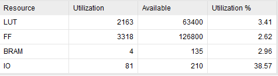
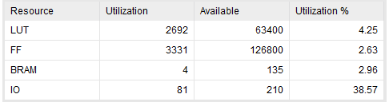

# 计算机体系结构实验三--实验报告
Author: PB17111614 王嵘晟
## cache 编写与设计
- 对于 k 路组相连的理解：组相连度 k 代表了每组有 k 路 line。在使用 set 定位到对应的组后，需要的 cache 块可能在该组中的任意一个位置上，需要并行比较 cache 组中的每一个块的 tag 和 valid 位，来确定最终引用的 line 的地址。对此，从直接映射改到组相连，首先拓展了 cache_mem, cache_tags, valid, dirty：
``` verilog
reg [            31:0] cache_mem    [SET_SIZE][WAY_CNT][LINE_SIZE]; // SET_SIZE个line，每个line有LINE_SIZE个word
reg [TAG_ADDR_LEN-1:0] cache_tags   [SET_SIZE][WAY_CNT];            // SET_SIZE个TAG
reg                    valid        [SET_SIZE][WAY_CNT];            // SET_SIZE个valid(有效位)
reg                    dirty        [SET_SIZE][WAY_CNT];
```
- 由于无论 FIFO 还是 LRU 都需要换出 cache 中停留时间最长的块，所以这里用一个数组来记录每个块中的内容被换入后维持的时间：
``` verilog
reg [31:0] record[SET_SIZE][WAY_CNT];      // 每块 cache 的历史记录，从被换入到现在的时间
```
这样在使用这两种策略的时候，当 cache miss ，只需要替换掉对应的 record 值最大的块。

- LRU 与 FIFO 的实现：由于对于 cache 的访问，即 read 或 write 请求信号是一个不止有一个周期的信号，所以为了防止写回策略长时间更新，这里使用一个标记位 access_signal 用来表示对 cache 有访问，对 cache 访问了则立即对历史记录进行更新，并根据访问结果(hit/miss)做出适当的操作。 hit 时仅把 hit 的数据对应的 record 清零，其他的 record 值加1。而 miss 时，替换数据，将被替换的数据的 record 置零，其他 record 的值加1。通过这种方法，当使用 LRU 时，替换掉 record 最大的数据，可以保证被替换掉的数据一定是最近最少使用的，而使用 FIFO 时，被替换掉的数据一定是最先进入 cache 的。
## cache 电路性能分析
首先保证组数为8不变的情况下，改变组相连度，分别取值1, 2, 4:
- LRU, 组相连度1:  
  
- LRU, 组相连度2:
  
- LRU, 组相连度4:  
  
- FIFO, 组相连度1:  
  
- FIFO, 组相连度2:  
  
- FIFO, 组相连度4:  
  

现在保证 cache 规模不变，即同时修改组数和组相连度:  
- LRU, 组相连度1, 组数8:   
  
- LRU, 组相连度2, 组数4:  
  
- LRU, 组相连度4, 组数2:  
  
- FIFO, 组相连度1, 组数8:   
  
- FIFO, 组相连度2, 组数4:  
  
- FIFO, 组相连度4, 组数2:  
  

结论：在这部分为看出FIFO的方法于LRU的方法没有明显的电路资源消耗差异，可能的原因是在我对LRU和FIFO两种方法的时间都采用了计数的方式，这种实现方式中，LRU仅比FIFO多一个边沿检测电路，导致两种方法电路资源消耗接近。但是对于组数相同时，提高组相连度明显会提高 cache 占用的电路资源量。当 cache 规模一定时，提高组相连度有同样的效果。所以提高组相连度可以导致电路开销代价增长。
## CPU cache 缺失率统计
这里直接用仿真结果通过表格呈现：
### 快速排序
#### 规模256
首先保持组数不变，改变组相连度:  
- LRU:

|  | 组相连度1，组数8 | 组相连度2，组数8 | 组相连度4，组数8 |  
| :----: | :------------: | :------------: | :------------: |  
| 访存次数 | 6168 | 6168 | 6168 |  
| miss 次数 | 766 | 572 | 73 |  
| 缺失率 | 12.42% | 9.27% | 1.18% | 
- FIFO:

|  | 组相连度1，组数8 | 组相连度2，组数8 | 组相连度4，组数8 |  
| :----: | :------------: | :------------: | :------------: |  
| 访存次数 | 6168 | 6168 | 6168 |  
| miss 次数 | 766 | 508 | 63 |  
| 缺失率 | 12.42% | 8.24% | 1.02% | 

再保持 cache 总大小不变，改变组数和组相连度:  
- LRU:

|  | 组相连度1，组数8 | 组相连度2，组数4 | 组相连度4，组数2 |
| :----: | :------------: | :------------: | :------------: |
| 访存次数 | 6168 | 6168 | 6168 |
| miss 次数 | 766 | 766 | 710 |
| 缺失率 | 12.42% | 12.42% | 11.51% |
- FIFO:  

|  | 组相连度1，组数8 | 组相连度2，组数4 | 组相连度4，组数2 |  
| :----: | :------------: | :------------: | :------------: |  
| 访存次数 | 6168 | 6168 | 6168 |  
| miss 次数 | 766 | 704 | 705 |  
| 缺失率 | 12.42% | 11.41% | 11.43% | 
#### 规模512
首先保持组数不变，改变组相连度:  
- LRU:

|  | 组相连度1，组数8 | 组相连度2，组数8 | 组相连度4，组数8 |  
| :----: | :------------: | :------------: | :------------: |  
| 访存次数 | 13882 | 13882 | 13882 |  
| miss 次数 | 1863 | 1367 | 219 |  
| 缺失率 | 13.42% | 9.85% | 1.58% | 
- FIFO:

|  | 组相连度1，组数8 | 组相连度2，组数8 | 组相连度4，组数8 |  
| :----: | :------------: | :------------: | :------------: |  
| 访存次数 | 13882 | 13882 | 13882 |  
| miss 次数 | 1790 | 1257 | 199 |  
| 缺失率 | 12.89% | 9.05% | 1.43% | 

再保持 cache 总大小不变，改变组数和组相连度:  
- LRU:

|  | 组相连度1，组数8 | 组相连度2，组数4 | 组相连度4，组数2 |
| :----: | :------------: | :------------: | :------------: |
| 访存次数 | 13882 | 13882 | 13882 |  
| miss 次数 | 1863 | 1835 | 1784 |  
| 缺失率 | 13.42% | 13.22% | 12.85% | 
- FIFO:  

|  | 组相连度1，组数8 | 组相连度2，组数4 | 组相连度4，组数2 |  
| :----: | :------------: | :------------: | :------------: |  
| 访存次数 | 13882 | 13882 | 13882 |  
| miss 次数 | 1863 | 1804 | 1755 |  
| 缺失率 | 13.42% | 12.99% | 12.64% | 
### 矩阵乘法
#### 规模8
首先保持组数不变，改变组相连度:  
- LRU:

|  | 组相连度1，组数8 | 组相连度2，组数8 | 组相连度4，组数8 |  
| :----: | :------------: | :------------: | :------------: |  
| 访存次数 | 1088 | 1088 | 1088 | 
| 缺失率 | 24.08% | 18.20% | 2.75% | 
- FIFO:

|  | 组相连度1，组数8 | 组相连度2，组数8 | 组相连度4，组数8 |  
| :----: | :------------: | :------------: | :------------: |  
| 访存次数 | 1088 | 1088 | 1088 | 
| 缺失率 | 24.08%     |     17.18%     |     2.20%      |

再保持 cache 总大小不变，改变组数和组相连度:  
- LRU:

|  | 组相连度1，组数8 | 组相连度2，组数4 | 组相连度4，组数2 |
| :----: | :------------: | :------------: | :------------: |
| 访存次数 | 1088 | 1088 | 1088 | 
| 缺失率 | 24.08%     |     45.86%     |     35.11% |
- FIFO:  

|  | 组相连度1，组数8 | 组相连度2，组数4 | 组相连度4，组数2 |  
| :----: | :------------: | :------------: | :------------: |  
| 访存次数 | 1088 | 1088 | 1088 | 
| 缺失率 | 24.08%     |     27.57%     |     38.97%      |
#### 规模16
首先保持组数不变，改变组相连度:  
- LRU:

|  | 组相连度1，组数8 | 组相连度2，组数8 | 组相连度4，组数8 |  
| :----: | :------------: | :------------: | :------------: |  
| 访存次数 | 8448 | 8448 | 8448 | 
| 缺失率 | 60.22%     |     56.21%     |     22.53% | 
- FIFO:

|  | 组相连度1，组数8 | 组相连度2，组数8 | 组相连度4，组数8 |  
| :----: | :------------: | :------------: | :------------: |  
| 访存次数 | 8448 | 8448 | 8448 | 
| 缺失率 | 60.22%     |     57.19%     |     20.21%  | 

再保持 cache 总大小不变，改变组数和组相连度:  
- LRU:

|  | 组相连度1，组数8 | 组相连度2，组数4 | 组相连度4，组数2 |
| :----: | :------------: | :------------: | :------------: |
| 访存次数 | 8448 | 8448 | 8448 | 
| 缺失率 | 60.22%     |     59.46%     |     55.11%  | 
- FIFO:  

|  | 组相连度1，组数8 | 组相连度2，组数4 | 组相连度4，组数2 |  
| :----: | :------------: | :------------: | :------------: |  
| 访存次数 | 8448 | 8448 | 8448 | 
| 缺失率 | 60.22%     |     59.47%     |     57.95%  | 
## 总结与结论
经过上面的测试，可以得出以下结论：

-   在只改变cache组相连度的时候，cache容量增大，随着组相联度增加，两个应用缺失率大幅度下降，在快速排序中，LRU的效果略好于FIFO；在矩阵乘法中，两种方法各有胜负。
-   在保证cache大小不变，调整组相联数和组数时，随着组相联度增加，两个应用的的缺失率都略有下降，但是FIFO的效果反而好于LRU。