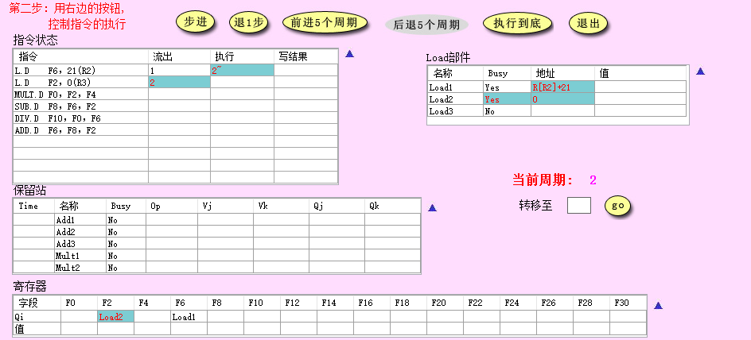
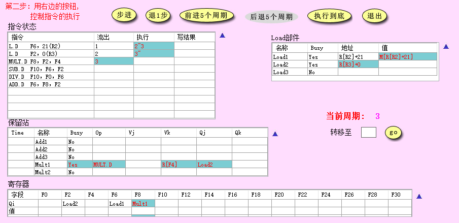
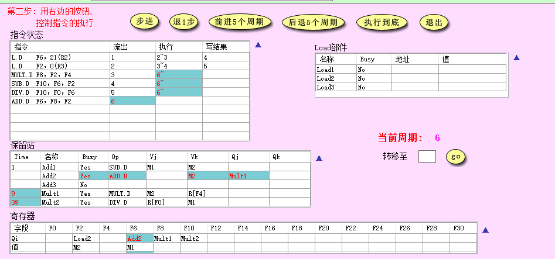
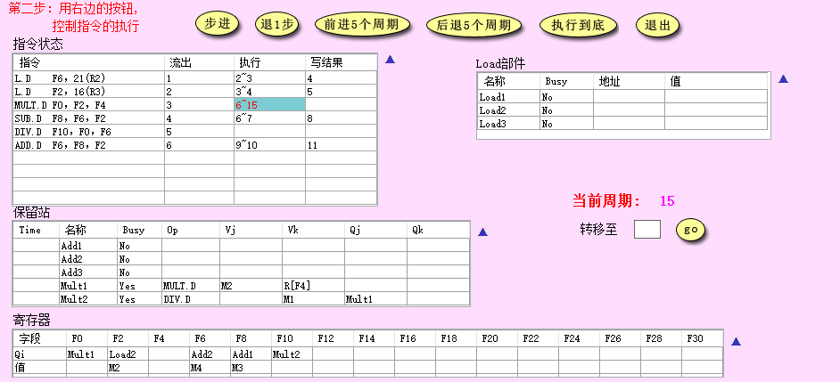
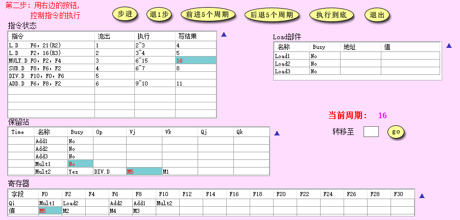
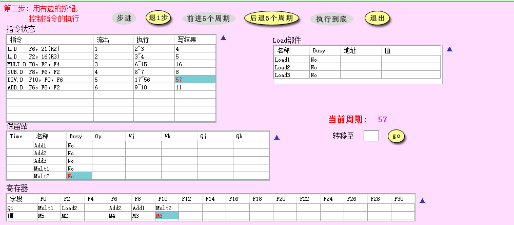
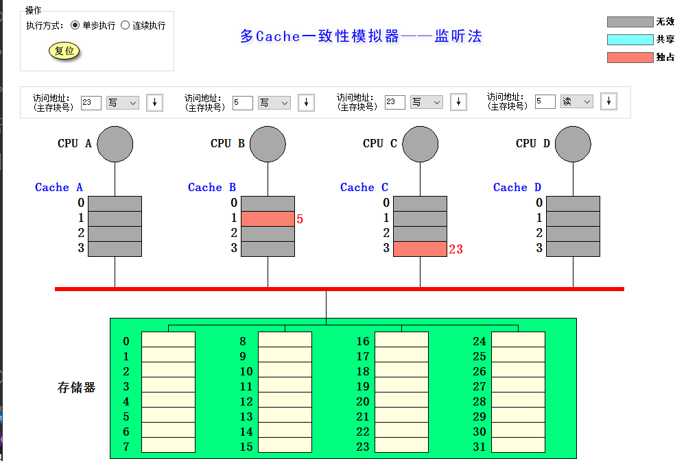
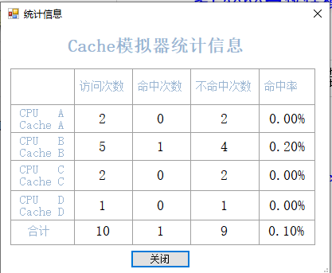
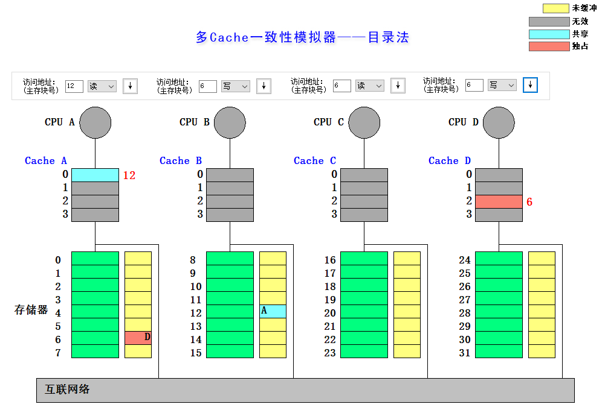
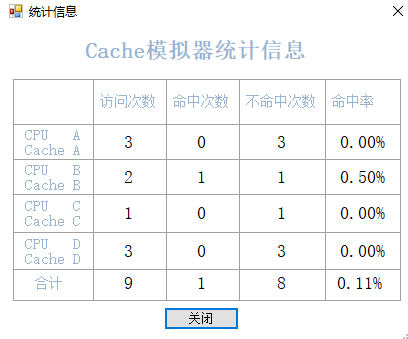

# lab5 多 Cache 一致性与 Tomasulu模拟器的使用
王嵘晟  
PB17111614
## Part 1 Tomasulo 模拟器
### 1.
- 周期2:  
  
由于在周期2中发射了第二条 load 指令，所以 Load 部件中的 load2 变为 busy 状态，同时计算得到第一条 load 指令的访存实际地址存入 load1 对应的地址，同时将第二条 load 指令中的变址参数先存入 Load 部件中 load2 对应的地址。
- 周期3:
  
由于在第3个周期时发射的不是 load 指令，所以 Load 部件中 load3 的 busy 状态依然是 no，而此时用 load1 的地址来访存，得到第一条 load 指令要返回的数据，装入 load1 对应的值中。同时，计算第二条 load 指令访问内存的实际地址，存入 load2 对应的地址中。
### 2.

- 指令状态： ADD.D 指令被发射，MULT.D SUB.D 开始执行。
- 保留站： 刚刚被发射的 ADD.D 指令被装入保留站的 Add2 中，Add2 状态变为 busy， Op 为 ADD.D，操作数 Vk, Qj 分别为 M2, Add1。由于 MULT.D 和 SUB.D 开始执行，所以保留站中这两条指令的 Time 值减1。
- 寄存器： 由于第一条 L.D 指令已经执行完毕写回，所以 F6 不再被 Load1 占用，而是变为 Add2
- Load 部件： 与前一个周期相比没有变化，因为 L.D 指令已经访存结束，开始写回
### 3.
与第二条 L.D 指令有 RAW 相关，需要等待 Load2 执行完毕将结果写入 F2 后才能执行。
### 4.
  
  
第15周期 MULT.D 指令执行结束，在第16周期将结果写回 F0 寄存器。第16周期比第15周期的变化在于：由于 MULT.D 指令执行完毕，所以保留站 Mult1 清空，而 MULT.D 指令将计算结果写回了 F0 所以寄存器 F0 中的值为 M5。Mult2 中的 DIV.D 指令的参数 Vj 中填入 MULT.D 的结果 M5
### 5.
  
第57周期，所有指令执行结束
## Part 2 多cache一致性算法-监听法
| 所进行的访问 | 替换 | 写回 | 监听协议进行的操作与块状态改变 |
| :---------: | :--:| :--: | :--------------------------: |
| CPU A 读第5块| N | N | 将存储器块号为5的块送到 Cache A 中块号为1的块里状态为共享，然后送到 CPU A |
| CPU B 读第5块| N | N | 将存储器块号为5的块送到 Cache B 中块号为1的块里状态为共享，然后送到 CPU B |
| CPU C 读第5块| N | N | 将存储器块号为5的块送到 Cache B 中块号为1的块里状态为共享，然后送到 CPU C |
| CPU B 写第5块| Y | N | 命中，将写的数据直接从 CPU B 装入 Cache B 中块号为1的块，然后将该块状态变为独占，把 Cache A 与 Cache C 中55块号为1的块状态更改为无效 |
| CPU D 读第5块| N | Y | 首先读不命中，然后将 Cache B 中1号块中内容写回存储器5号块，再将存储器5号块送到 Cache D 中1号块里，将该块与 Cache B 中一号块的状态设置为共享，然后送到 CPU A |
| CPU B 写第21块| Y | N | Cache 不命中，先将存储器中第21块送入 Cache B 的第1块替换掉原来的第5块，然后从 CPU B 向 Cache B 第1块中写入数据，将状态变为独占 |
| CPU A 写第23块| N | N | 将存储器中第23块送入 Cache A 中第三块，然后从 CPU A 向该块写入数据，将状态变为独占 |
| CPU C 写第23块| Y | Y | 读不命中，先将 Cache A 的第3块写回存储器第23块，将 Cache A 第3块状态改为无效。再将存储器第23号块送入 Cache C 3号块，CPU C 向该块写入数据，然后将状态改为独占 |
| CPU B 读第29块| Y | Y | 不命中，首先 Cache B 中第一块写回到存储器第21块，然后将存储器第29块送入 Cache B 第一块，状态为共享，把数据送到 CPU B |
| CPU B 写第5块| Y | N | 写不命中，首先从存储器中取出第5块放入 Cache B 中第一块，然后 Cache D 中第一块变为无效状态，从 CPU B 向 Cache B 第一块写数据，状态变为独占

  
## Part 3 多cache一致性算法-目录法
| 所进行的访问 | 目录协议进行的操作与块状态改变 |
| :---------: | :--------------------------: |
| CPU A 读第6块 | 读不命中，本地：向宿主结点发送读不命中(A, 6)信息，宿主：把数据块送给本地结点，共享集合：{A} |
| CPU B 读第6块 | 读不命中，本地：向宿主结点发送读不命中(B, 6)信息，宿主：把数据块送给本地结点，共享集合：{A}+{B} |
| CPU D 读第6块 | 读不命中，本地：向宿主结点发送读不命中(D, 6)信息，宿主：把数据块送给本地结点，共享集合：{AB}+{D} |
| CPU B 写第6块 | 写命中，本地：向宿主结点发送写命中(B, 6)消息，宿主：向远程结点 A, D 发送作废结点(6)的消息，共享集合：{B} |
| CPU C 读第6块 | 读不命中，本地：向宿主结点发送读不命中(C, 6)信息，宿主：远程结点发送取数据块(6)的消息，远程：数据块送给宿主结点，宿主：数据块送给本地结点，共享集合：{B}+{C} |
| CPU D 写第20块 | 写不命中，本地：向宿主结点发送写不命中(D, 20)消息，宿主：把数据块送给本地结点，共享集合为：{D} |
| CPU A 写第20块 | 写不命中，本地：向宿主结点发送写不命中(A, 20)消息，宿主：给远程结点发送取并作废(20)的消息，远程：把数据库送给宿主结点并把 Cache 中的该块作废，宿主：把数据块送给本地结点,共享集合：{A} |
| CPU D 写第6块 | 写不命中，本地：向宿主结点发送写不命中(D, 6)消息，宿主：给远程结点发送作废(6)的消息，将数据块送给本地结点，共享集合{D} |
| CPU A 读第12块 | 读不命中，本地：向被替换的宿主结点发送写回并修改共享集(A, 20)消息，向宿主结点发送读不命中(A, 12)消息，宿主：把数据块送给本地结点，共享集合为：{A} |

  

## Part 4
### 1. 目录法和监听法分别是集中式和基于总线，两者优劣是什么？（言之有理即可）
目录法比监听法有更好的可扩展性，但是目录存储开销比较大，同时有访问延迟也可能比较大。而监听法虽然存储开销和访问时间开销比较小但由于基于总线传输数据，存储器规模不宜太大。
### 2.Tomasulo算法相比Score Board算法有什么异同？（简要回答两点：1.分别解决了什么相关，2.分别是分布式还是集中式）（参考第五版教材）
相同：两者消除RAW竞争的思想相同。Tomasulo方法采用了记分牌方法的动态调度的核心思想，多条指令处于发射状态，等待条件成熟，可以不按顺序执行，不按顺序完成的思想，即为动态调度来消除RAW竞争  
不同：Tomasulo方法通过寄存器换名过程可以消除WAR和WAW竞争。记分牌方法能检测WAR和WAW竞争，一旦检测到存在WAR和WAW竞争，通过插入停顿周期来解决这一竞争。  
Tomasulo 通过寄存器重命名避免了名称相关，解决了 RAW、WAW、WAR 冒险，是分布式的  
Score Board 算法发送到运算器的顺序可能是乱序的，解决了 RAW、WAW数据冒险，和结构冒险。是集中式的
### 3. Tomasulo算法是如何解决结构、RAW、WAR和WAW相关的？（参考第五版教材）
通过寄存器重命名可以解决 WAR 和 WAW，使用保留站，将被发射指令的待用寄存器重命名，改为保留站的名字从而避免了 WAR 和 WAW  
虽然 Tomasulo 是单发射的，但发射后不立即执行，而是多条指令处于发射状态，等待条件成熟，可以不按顺序执行，不按顺序完成的思想，即为动态调度来消除RAW竞争