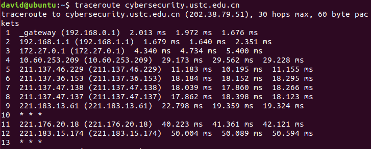
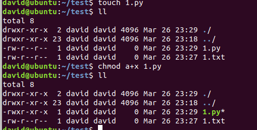
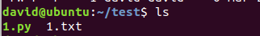
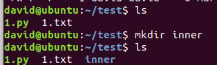
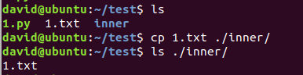
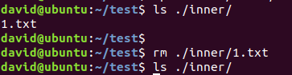
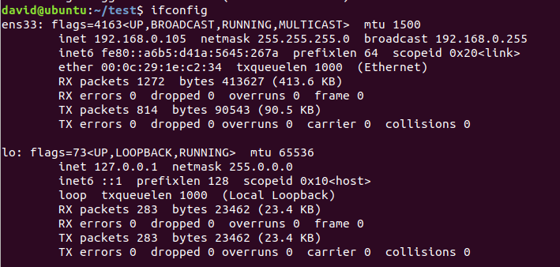

# LAB 1
### (1)
>在ubuntu虚拟机运行traceroute cybersecurity.ustc.edu.cn，前13跳

### (2)
 >在ubuntu Linux虚拟机下运行chmod, chown, ls, mkdir, cp, rm, ifconfig

 >chmod

 >chown

 
 >ls

 
 >mkdir

 
 >cp

 
 >rm

 
 >ifconfig

 