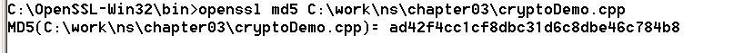
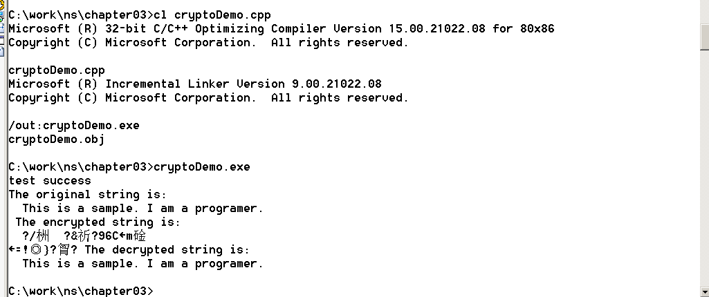
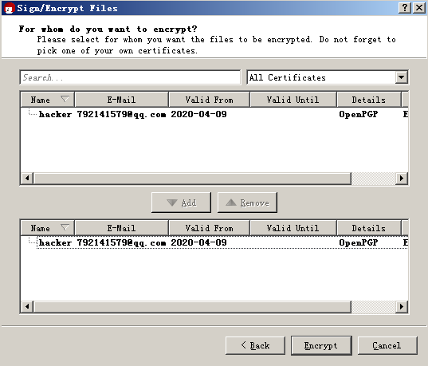
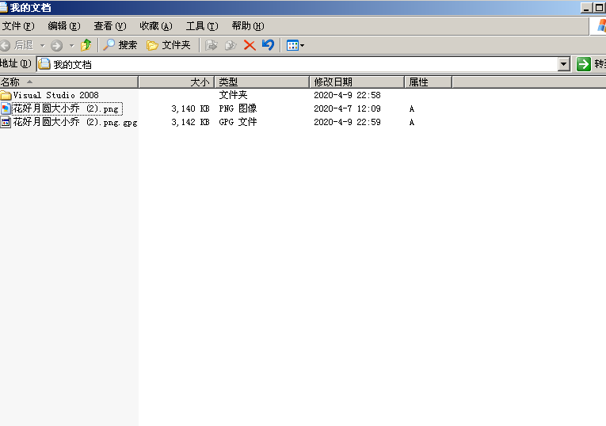

# LAB 2
## PB17111614 王嵘晟
### 1.使用 OpenSSL 的常用命令

这是利用 openssl 的 md5 算法来做加密，得到加密后的字符串
### 2.利用 OpenSSL 编程实现 AES 的 加密、解密
导入openssl\aes.h头文件后，对cryptoDemo.cpp进行编译然后运行，得到了正确结果：  
  
这实现了对字符串的加密与解密
### 3.用 PGP 实现加密和解密
首先建立公钥，然后将虚拟机导出的私钥发送到主机上并导入。  
然后加密一张图片：  
  
加密成功得到gpg文件：  
  
解密后还原文件：  
  
### 4.修改例程cryptoDemo.cpp为encfile.cpp：从命令行接受3个字符串类型的参数：参数1，参数2，参数3。参数1=enc表示加密，参数1=dec表示解密；参数2为待加密、解密的文件名；参数3为密码，并用 http://cybersecurity.ustc.edu.cn/InfoSecIntro/InfoSecIntro.htm 为测试文件，验证正确性
首先新自建了两个函数：Encrypt 和 Decrypt，作为加密和解密函数。
通过gcc编译生成可执行文件，用 信息安全导论 （2019年秋季）.html作为测试文件完成实验
### 小结：
本次实验学习了openssl加密字符串、用公钥加密私钥解密文件，以及AES算法加密文件，对于相关内容有了更深刻理解。