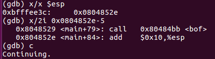
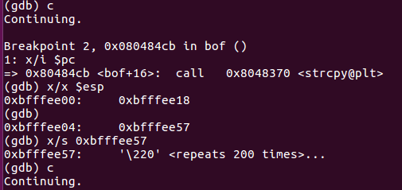
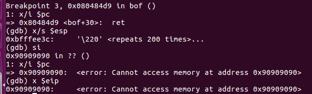
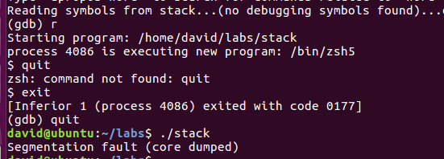
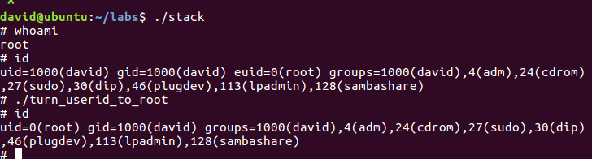
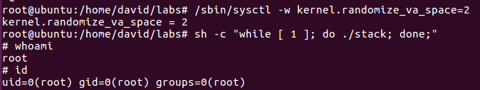
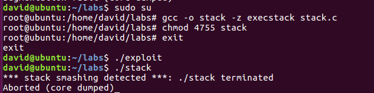
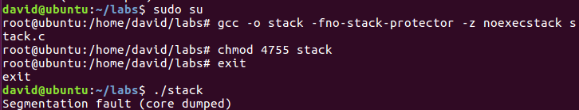

# 第三次实验报告
## PB17111614 王嵘晟
### Buffer overflow lab
### 实验环境： 32位Ubuntu 16.04
#### 1.实验步骤
##### Task 1
首先关闭系统的地址空间随机化：  
``` bash
su root
Password: (enter root password)
sysctl -w kernel.randomize_va_space=0
```
strcpy由于不检查边界，因此会覆盖函数的返回地址。函数返回时，会读取覆盖的返回地址中的指令执行，即执行shellcode。由于这里buffer的大小为517，所以当作大缓冲区的本地溢出攻击来处理，将shellcode直接写入exploit.c的buffer中，然后在stack中进行strcpy。  
为此需要先通过GDB调试来获取stack程序运行时的buffer的首地址与返回地址所在栈的距离。调试过程如下：  
  
确定A，即堆栈指针esp的值A=0xbfffee3c
  
确定B，即buffer的首地址B=0xbfffee18，经由计算得A-B=0x24。所以当buffer中内容的长度大于0x24时会出现缓冲区溢出的情况，这时返回地址将被改写。  
  
调试所得的最终程序返回地址  
  
所以现在可以对于exploit.c文件进行改写：  
``` C
strcpy(buffer + (517 - strlen(shellcode) -1), shellcode);
int offset = 0x24;      // A-B=24, calculated by testing in GDB
unsigned long *position = (unsigned long *)(buffer + offset);
*(position) = (0xbfffee18 + offset + 4);
buffer[516] = 0;
```
将shellcode直接写进buffer中对应的位置，并把\*position附以相对应的值。  
  
在GDB中运行程序，发现可以正常运行，但直接在shell中执行程序发现会出现段错误。分析原因发现这是ubuntu的缓冲区保护机制，需要在buffer最后加足够多的nop。对\*(position)做如下修改：  
``` C
*(position) = (0xbfffee18 + offset + 4 + 64);
```
这时发现问题得到解决，可以在shell里正常运行：  
  
这时得到的uid是用户的uid而不是root的uid，编写turn_userid_to_root.c并编译运行：
``` C
void main()
{
    setuid(0);
    system("/bin/sh");
}
```
  
这时可以成功得到root的id。
#### Task 2
首先恢复内存地址的随机化：
``` bash
su root
Password: (enter root password)
/sbin/sysctl -w kernel.randomize_va_space=2
```
然后直接运行stack。由于地址空间随机化存在，所以这时需要的时间比较长，在两个小时后，终于跑出来了：  
  
#### Task 3
首先关闭系统的地址空间随机化：  
``` bash
su root
Password: (enter root password)
sysctl -w kernel.randomize_va_space=0
```
带有stack protector的情况下重新编译stack.c:  
``` bash
su root
Password (enter root password)
gcc -o stack -z execstack stack.c
chmod 4755 stack
exit
```
重新执行Task1，结果如下：  
  
因为gcc重新编译时带有stack protector，而根据生成的badfile会导致缓冲区溢出存在，所以这时系统会检测到stack smashing而直接终止程序
#### Task 4
编译stack.c时选择noexectstack:  
``` bash
su root
Password (enter root password)
gcc -o stack -fno-stack-protector -z noexecstack stack.c
chmod 4755 stack
exit
```
再次重新执行Task1，结果如下：  
  
无法进入shell，原因是编译时选择了non-executable stack，所以内核和动态链接会认为这个程序运行时堆栈空间是不可执行的，所以会出现segmentation fault。
### 2.实验小结
对于实验文档中问题的回答均已写到了实验步骤的文字记录中。  
本次缓冲区溢出攻击实验，主要难点在于对于可以产生缓冲区溢出的代码进行调试以求得stack程序运行时的buffer的首地址与返回地址所在栈的距离以及对于大缓冲区的本地溢出攻击的攻击串的编写。不过这也是令我收获最多的一个地方。此外，对于ubuntu gcc编译的特点有了一定的了解，例如gcc编译时默认no executable stack，默认有stack protector。而ubuntu系统的内存地址保护机制是对地址空间进行随机化，如果不关闭地址空间随机化想要直接攻击是相当困难的，task2我运行了两个小时才进入shell……总之经过了本次实验对于内存地址的攻防算是有了一个基础的了解。