# 第四次实验报告
## PB17111614 王嵘晟
### 1.虚拟机IP截图:  
- ClientA:  
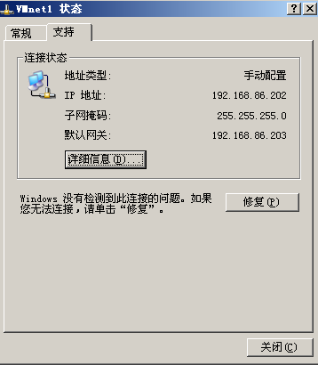  

- ServerA:  
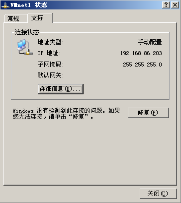  
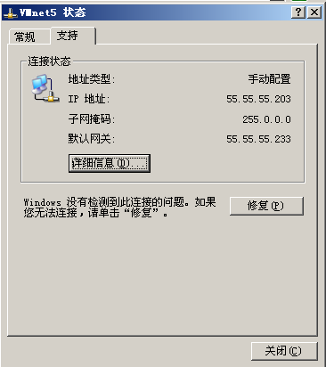  

- Router:  
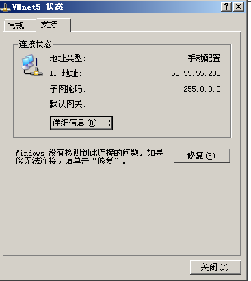  
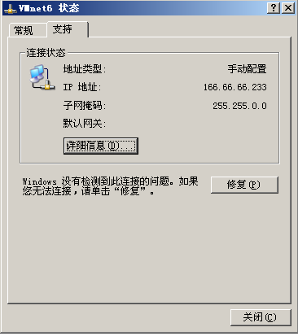  

- ServerB:  
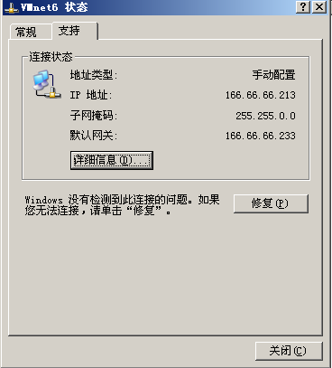  
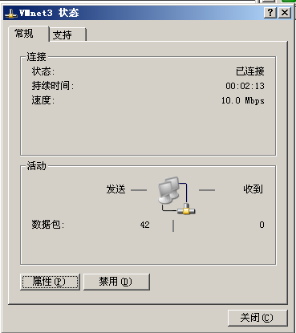  

- ClientB:  
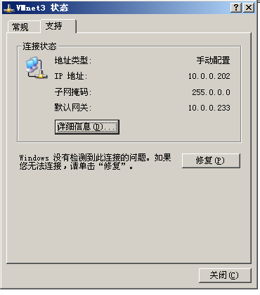 
### 2.
- ClientA ping 10.0.0.202
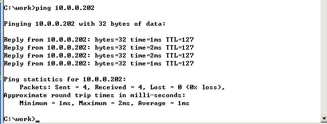  
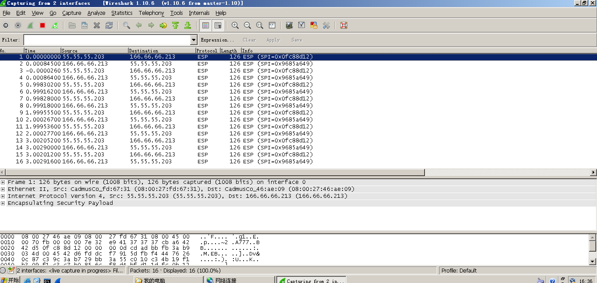

- ClientB ping 192.168.86.202
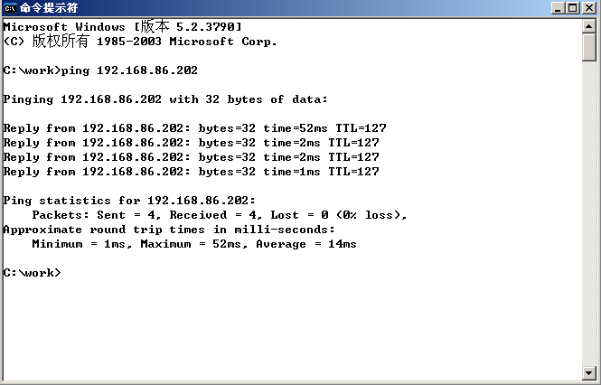  
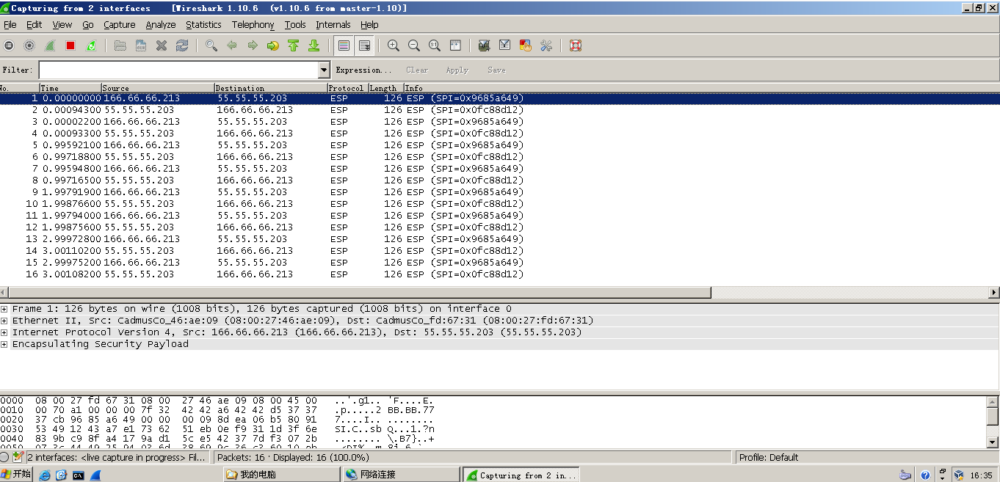