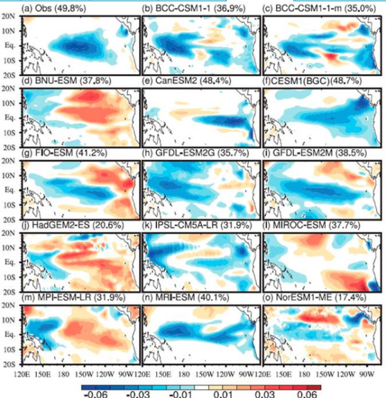
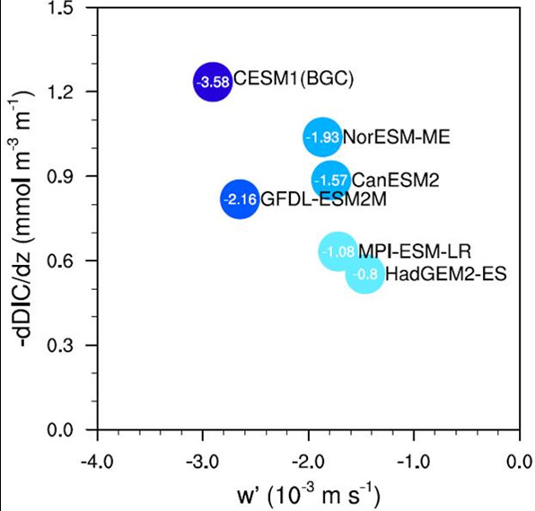

# HW1
## 1.11
并行计算的典型应用：  
&emsp;&emsp;中科曙光的地球系统数值模拟装置原型系统。应对气象学中气候和生态环境变化问题而创建，解决这类大尺度（区域、全球）、多圈层（大气圈、水圈、岩土圈、生物圈）的复杂科学问题，需要依仗发展完善的数值模拟手段。地球系统模拟不但大大深化了我们对地球系统演变规律的认识，还使得对未来演变的科学预测成为可能。  
&emsp;&emsp;在实际应用中，可以利用地球系统模式预估未来气候变化前有必要评估地球系统模式对海洋碳循环的模拟效果。模拟结果与物理结果对照如图所示：  
    
图一：1982-2005热带太平洋区域冬季（DJF）海气CO2通量第一主导模态（EOF1）的空间分布。百分比为EOF1的解释方差。数据经过8年高通滤波。BNU-ESM、HadGEM-ES和MPI-ESM-LR与观测的海温异常几乎相反。    
   
图2 横坐标为热带太平洋区域（160°E–120°W）200m以上的海水垂直速度（单位：10-3m s-1），纵坐标为气候态的溶解无机碳（DIC）的垂直梯度（单位：mmol m-3 m-1），为100m以上和100-200m的DIC浓度之差。途中圆圈中给出了两者的乘积的数值，同时表示为颜色的深浅。乘积反映了El Nino期间海表DIC浓度的变化，从而影响海水CO2分压和海气CO2通量。  
可见模拟结果与物理结果有高度的相似性。  
&emsp;&emsp; 应用运行在曙光最新的硅立方系列高性能计算机上，属于分布式计算平台。高性能计算机系统采用国产 X86 处理器和加速部件，从内存带宽，超线程、Open MP 加速、文件系统稳定性等方面进行软硬件的协同优化。用于第六阶段国际耦合模式比较计划（CMIP6）的 CAS-ESM 业已定版并顺利在大装置 1 期计算系统上运行，现阶段正在进行 CMIP6 科学模拟试验。  
&emsp;&emsp;曙光新一代硅立方高性能计算机的性能是600 PFlops（2018），对于该应用的实际工作性能来说，运行平台的硬件配置远高于实际工作性能。  
&emsp;&emsp;我认为该应用的拓展性还是比较可观的，想要在现有的系统上再做升级可以更合理化建模分析，以求达到对硬件设施的尽可能利用。  
## 2.
150W配置计算资源：  
服务器：Eell EMC PowerEdge R740 至强 2*4214  价格43999 *8组   
GPU： NVIDIA/英伟达 大数据并行计算 Tesla V100 GPU加速运算显卡 价格67062 *8组  
硬盘：Dell/戴尔 R730XD机架式服务器存储 E5-2620V4/16G 400G SSD 价格9790 *16组  
制冷：曙光 GreenLP冷板式液冷配套基础设施C7000 价格约40000 *4组  
此处共1205128元，剩余预算可用来配置其他配件  