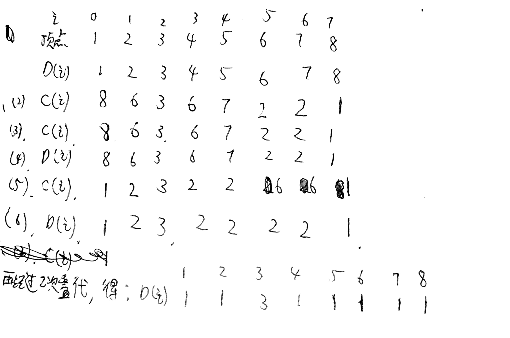

# HW3
## PB17111614 王嵘晟
### 1.
#### (1).
>(1.2)处所标识的循环可以做并行化
#### (2).
将(1.2)处串行代码改为如下并行代码：  
for all Pj whre 1&le;j&le;p  &emsp;&emsp;/*p为处理器个数，Pj为第j个处理器 */  
&ensp;&emsp;for k = j to i-1 step P do  
&ensp;&emsp;&ensp;&emsp;bk = bk - akixi  
&ensp;&emsp;&ensp;&emsp;aki = 0  
&ensp;&emsp;end for  
end for all  
计算模型为UMA,由于对于内循环做了并行化处理，可以在O(1)的时间内完成内循环，而外循环总共需要执行n次，所以总的时间复杂度为O(n)。
### 2.
#### (1).
对于算法7.12，第(1)部分的时间复杂度为O(1)，需要O(n)个处理器。第(2)到(6)部分做logn次迭代，对于(2)，找邻顶的最小者需要O(n)的时间，O(n)个处理器。这是对于(2)到(6)来说时间复杂度最大的步骤。考虑通信时间同样为O(n)后，总的t(n)=O(nlgn),p(n)=O(n)  
#### (2).
