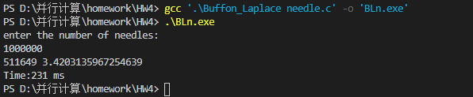

# HW4
## PB17111614
## 王嵘晟
### 15.1
#### (1)
代码计算功能：Process0 把从 msg1 开始的缓冲区中长度为 count1, 数据类型为 MPI_INT 的数据发送出去，消息标签为 tag1, 通信域为 comm1。Process1 把接收到的消息标签为 tag1, 通信域为 comm1的数据接收到缓冲区 msg1, 长度为 count1, 数据类型为 MPI_INT。以此来完成两个进程之间的通信。
### (2)
因为没有通信体，所以发送的数据无法被接收，是无用的发送。
### 15.3
``` C
for (i = 0; i < 10; i ++)   buff[i] = data[31*i];
MPI_sen(buff, 10, MPI_FLOAT, dest, tag, MPI_COMM_WORLD);
```
### 15.13(1)
根据公式可知:当a=b=2l时，针至少落在一根线上的概率是&pi;的倒数乘7/4。所以编写程序:
``` C
#include <stdio.h>
#include <stdlib.h>
#include <string.h>
#include <math.h>
#include <time.h>

float Randomf(float a, float b)           // 生成a, b中间一个随机数
{ 
    int na = (int)(a * 10000); 
    int nb = (int)(b * 10000); 
    int temp = rand() % ( nb - na + 1 ); 
    temp += na; 
    return (temp / 10000.0); 
}
    
int Randomi(int i, int j) 
{ 
    int temp; 
    temp =( rand() % ( j - i + 1 )) + i; 
    return temp; 
}

int main()
{
    long int start, end;
    int N;
    printf("enter the number of needles: \n");
    scanf("%d", &N);
    start = clock();
    int temp = N;
    int cnt = 0;        // 次数
    int a = 2;
    int b = 2;
    int l = 1;
    double width, height;
    float x1, y1, x2, y2;
    int xm, xM, ym, yM;
    int degree;
    while (temp --)
    {
        x1 = Randomf(0.0,100.0); 
        y1 = Randomf(0.0,100.0); 
        degree = Randomi( 0, RAND_MAX); 
        height = sin(degree); 
        width = cos(degree); 
        x2 = x2 + l * width; 
        y2 = y1 + l * height; 
        xm = (x1 < x2)? (int)x1 : (int)x2;
        xM = (x1 >= x2)? (int)x1 : (int)x2;
        ym = (y1 < y2)? (int)y1 : (int)y2;
        yM = (y1 >= y2)? (int)y1 : (int)y2;
        if ((xm % 2) == 0 && (xM % 2) != 0)
        {
            cnt ++;
        }
        if ((ym % 2) == 0 && (yM % 2) != 0)
        {
            cnt ++;
        }
        if (((xm % 2) == 0 && (xM % 2) != 0) && ((ym % 2) == 0 && (yM % 2) != 0))
        {
            cnt --;
        }
    }
    float result;
    printf("%d ", cnt);
    result = (float)N / (float)cnt;
    result *= 7;
    result /= 4;
    printf("%.16f\n", result);

    end = clock();
    printf("Time:%ld ms\n", end - start);
}
```
运行结果:  
  
可见计算误差还是比较大的，&pi;的可靠位只有整数位，运行时间为231ms