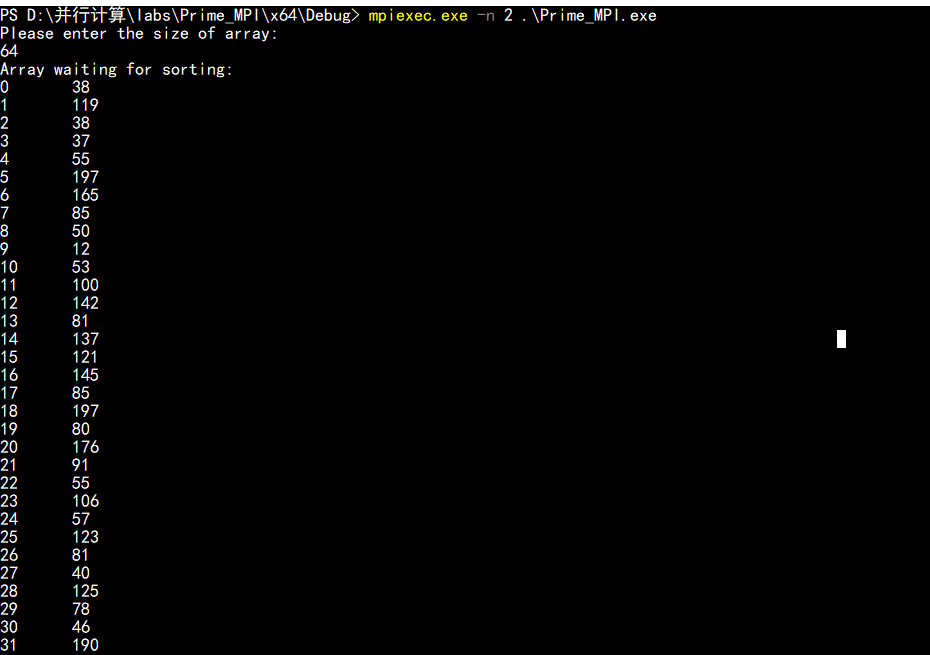
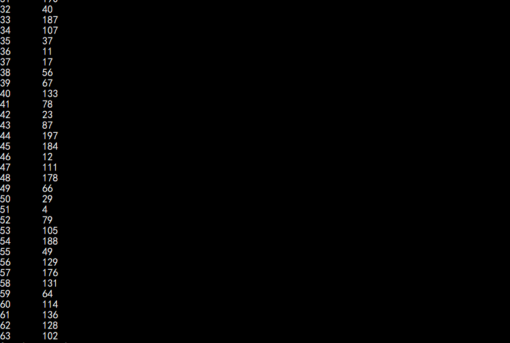
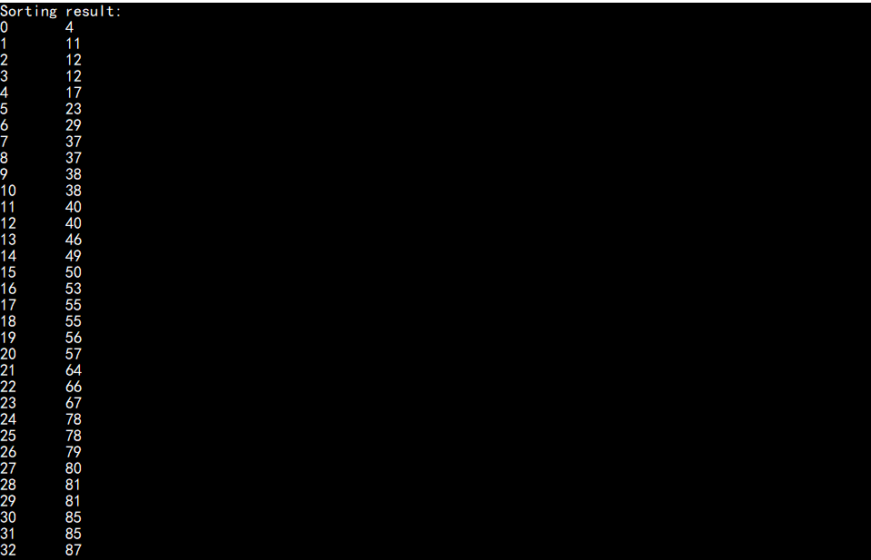
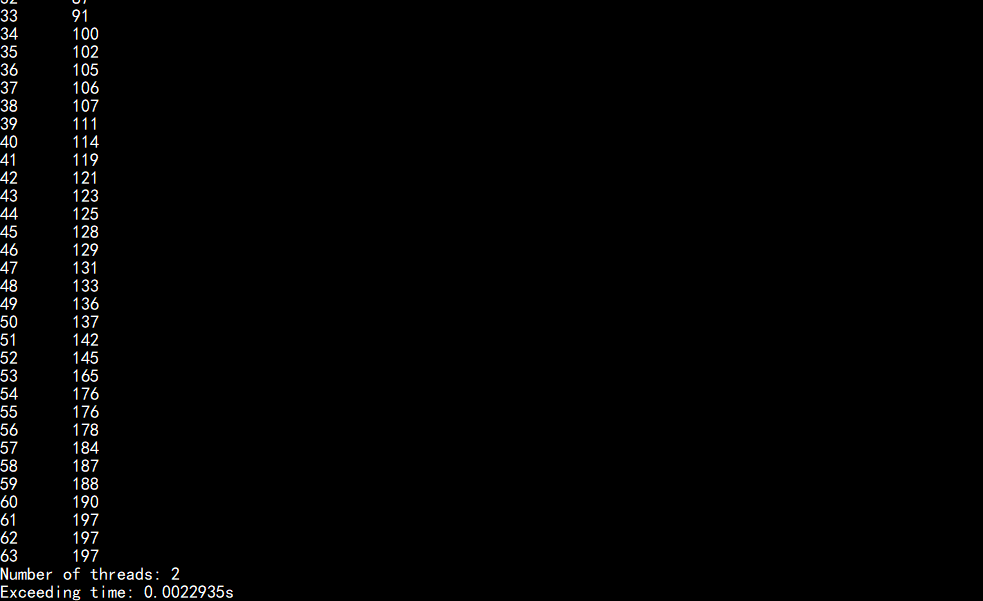

# 实验四
姓名：王嵘晟  
学号： PB17111614
# 利用 MPI 解决 N 体问题
## 实验环境

操作系统： Windows 10  
IDE： Visual Studio 2019  X64 Debug 模式
MPI环境： MS-MPI V10  
硬件配置： Intel CORE i7 6550U  
## 算法设计与分析
1. 均匀划分，将 num 个数据均匀分成 mpi_threads_num 组，第 i 号线程处理第 num * i / mpi_threads_num 组
2. 局部排序，各进程对于自己的数据进行排序
3. 选取样本， p 个进程中每个进程选出 p 个样本，规则为 i * dataLength/p
4. 用一个进程对 ppp 个进程的共 p×pp\times pp×p 个样本进行排序，此时样本都是局部有序的，使用归并能减少时间复杂度
5. 选取主元，一个进程从排序好的样本中选取 p-1 个主元，规则为 i*p
6. 主元划分，p 个进程按照 p-1 个主元划分成 p 段
7. 全局交换，进程 i (i=0,1,…p−1)i\ (i=0,1,\dots p-1)i (i=0,1,…p−1) 将第 j (j=0,1,…,p−1)j\ (j=0,1,\dots,p-1)j (j=0,1,…,p−1) 段发送给进程 jjj。也就是每个进程都要给其它所有进程发送数据段，并且还要从其它所有进程中接收数据段，所以称为全局交换。
8. 归并排序，各处理器对接收到的 p 个数据段进行排序，这 p 个数据段已经是局部有序的
## 核心代码
``` C++
void Communicate(int mypid, int mpi_threads_num, int* partitions, int* partsizes, int* array)
{
	// 存储排序结果的数组
	int* sortedSubList;
	// 根进程上相对于 recvbuf 的偏移量
	int* recvDisOffset;
	// 划分区间末尾
	int* partitionEnds;
	int* indexes;
	int* subListsSizes;
	int totalSize;
	int i, j;

	partitionEnds = (int*)malloc(mpi_threads_num * sizeof(int));
	indexes = (int*)malloc(mpi_threads_num * sizeof(int));
	indexes[0] = 0;
	totalSize = partsizes[0];

	for (i = 1; i < mpi_threads_num; i++)
	{
		totalSize += partsizes[i];
		indexes[i] = indexes[i - 1] + partsizes[i - 1];
		partitionEnds[i - 1] = indexes[i];
	}
	partitionEnds[mpi_threads_num - 1] = totalSize;

	sortedSubList = (int*)malloc(totalSize* sizeof(int));
	subListsSizes = (int*)malloc(mpi_threads_num * sizeof(int));
	recvDisOffset = (int*)malloc(mpi_threads_num * sizeof(int));

	// 归并
	for (i = 0; i < totalSize; i++)
	{
		int lowest = 100000;
		int ind = -1;
		for (j = 0; j < mpi_threads_num; j++)
		{
			if ((indexes[j] < partitionEnds[j]) && (partitions[indexes[j]] < lowest))
			{
				lowest = partitions[indexes[j]];
				ind = j;
			}
		}
		sortedSubList[i] = lowest;
		indexes[ind] += 1;
	}

	// 将各子列大小发送回 thread 0
	MPI_Gather(&totalSize, 1, MPI_INT, subListsSizes, 1, MPI_INT, 0, MPI_COMM_WORLD);

	// 计算 thread 0 上相对 recvbuf 的偏移量
	if (mypid == 0)
	{
		recvDisOffset[0] = 0;
		for (i = 1; i < mpi_threads_num; i++)
		{
			recvDisOffset[i] = subListsSizes[i - 1] + recvDisOffset[i - 1];
		}
	}

	// 将排序好的子列表发送回 thread 0
	MPI_Gatherv(sortedSubList, totalSize, MPI_INT, array, subListsSizes, recvDisOffset, MPI_INT, 0, MPI_COMM_WORLD);

	free(recvDisOffset);
	free(subListsSizes);
	free(sortedSubList);
	free(indexes);
	free(partitionEnds);
}

void PSRS(int* array, int num)
{
	int mypid, mpi_threads_num;
	int* partsizes, * newpartsizes;
	int subArraySize, startIndex, endIndex;
	int* sample, * newPartitions;
	int localN = num / THREADS;
	int step = localN / THREADS;

	MPI_Comm_size(MPI_COMM_WORLD, &mpi_threads_num);
	MPI_Comm_rank(MPI_COMM_WORLD, &mypid);

	sample = (int*)malloc(mpi_threads_num * mpi_threads_num * sizeof(int));
	partsizes = (int*)malloc(mpi_threads_num * sizeof(int));
	newpartsizes = (int*)malloc(mpi_threads_num * sizeof(int));

	for (int k = 0; k < mpi_threads_num; k++)
	{
		partsizes[k] = 0;
	}

	startIndex = mypid * num / mpi_threads_num;
	if (mpi_threads_num == (mypid + 1))
	{
		endIndex = num;
	}
	else
	{
		endIndex = (mypid + 1) * num / mpi_threads_num;
	}
	subArraySize = endIndex - startIndex;
	MPI_Barrier(MPI_COMM_WORLD);

	// 子数组局部排序
	qsort(array + startIndex, subArraySize, sizeof(array[0]), CMP);

	// 正则采样
	for (int i = 0; i < mpi_threads_num; i++)
	{
		sample[mypid * THREADS	 + i] = *(array + (mypid * localN + i * step));
	}

	int* pivot_number = (int*)malloc((mpi_threads_num - 1) * sizeof(sample[0])); //主元
	int index = 0;
	MPI_Barrier(MPI_COMM_WORLD);

	if (mypid == 0)
	{
		//对正则采样的样本进行排序
		qsort(sample, mpi_threads_num * mpi_threads_num, sizeof(sample[0]), CMP);

		// 采样排序后进行主元的选择
		for (int i = 0; i < (mpi_threads_num - 1); i++)
		{
			pivot_number[i] = sample[(((i + 1) * mpi_threads_num) + (mpi_threads_num / 2)) - 1];
		}
	}

	MPI_Bcast(pivot_number, mpi_threads_num - 1, MPI_INT, 0, MPI_COMM_WORLD);

	// 主元划分
	for (int i = 0; i < subArraySize; i++)
	{
		if (array[startIndex + i] > pivot_number[index])
		{
			index += 1;
		}
		if (index == mpi_threads_num)
		{
			partsizes[mpi_threads_num - 1] = subArraySize - i + 1;
			break;
		}
		// 划分大小自增
		partsizes[index]++;
	}
	free(pivot_number);

	int totalSize = 0;
	int* sendDisOffset = (int*)malloc(mpi_threads_num * sizeof(int));
	int* recvDisOffset = (int*)malloc(mpi_threads_num * sizeof(int));
	
	// 全局到全局的发送
	MPI_Alltoall(partsizes, 1, MPI_INT, newpartsizes, 1, MPI_INT, MPI_COMM_WORLD);

	// 计算划分的总大小，并给新划分分配空间
	for (int i = 0; i < mpi_threads_num; i++)
	{
		totalSize += newpartsizes[i];
	}
	newPartitions = (int*)malloc(totalSize * sizeof(int));

	sendDisOffset[0] = 0;
	recvDisOffset[0] = 0;
	for (int i = 1; i < mpi_threads_num; i++)
	{
		sendDisOffset[i] = partsizes[i - 1] + sendDisOffset[i - 1];
		recvDisOffset[i] = newpartsizes[i - 1] + recvDisOffset[i - 1];
	}

	//发送数据，实现n次点对点通信
	MPI_Alltoallv(&(array[startIndex]), partsizes, sendDisOffset, MPI_INT, newPartitions, newpartsizes, recvDisOffset, MPI_INT, MPI_COMM_WORLD);

	free(sendDisOffset);
	free(recvDisOffset);

	Communicate(mypid, mpi_threads_num, newPartitions, newpartsizes, array);

	if (mpi_threads_num > 1)
	{
		free(newPartitions);
	}
	free(partsizes);
	free(newpartsizes);
	free(sample);
}
```
## 实验结果
num = 64时的运行截图：  
  
  
  
  

时间
| 规模\进程数 | 1 | 2 | 4 | 8 |
| :--------: |:-:|:-:|:-:|:-:|
| num=1000000 | 0.310621s | 0.222055s | 0.230188s | 0.270815s |
| num=5000000 | 1.579457s | 1.046135s | 0.716945s | 0.874196s |
| num=10000000 | 3.188709s | 2.006389s | 1.397738s | 1.659608s |

加速比(与串行相比)
| 规模\进程数 | 1 | 2 | 4 | 8 |
| :--------: |:-:|:-:|:-:|:-:|
| num=1000000 | 1 | 1.398847 | 1.349423 | 1.146986 |
| num=5000000 | 1 | 1.509802 | 2.203038 | 1.806754 |
| num=10000000 | 1 | 1.589278 | 2.281335 | 1.921363 |
## 实验结论
1. 并行排序问题整体运算量偏小，只有当数据规模足够大时才能体现出来并行优化效果
2. 当线程数不变时加速比随着运算规模的增大而增大，当运算规模不变时，加速比随着进程数的增大而增大，当进程数超过物理内核数（4）时，加速比不再增大
3. num=1000000时计算量不够大，所以线程数增大加速比反而下降，这是通信时间带来的开销占比比较大