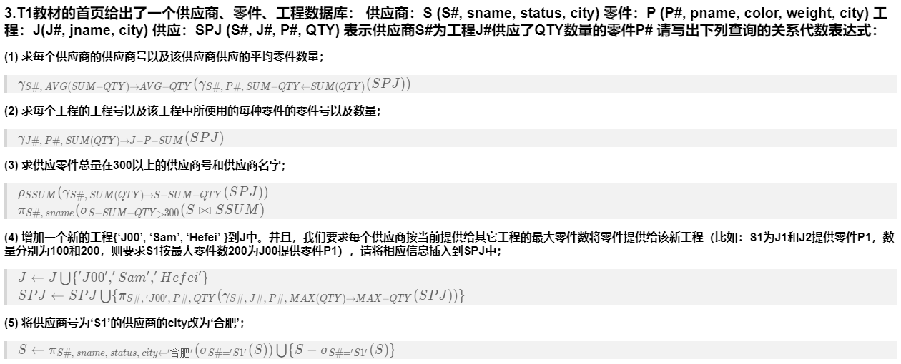
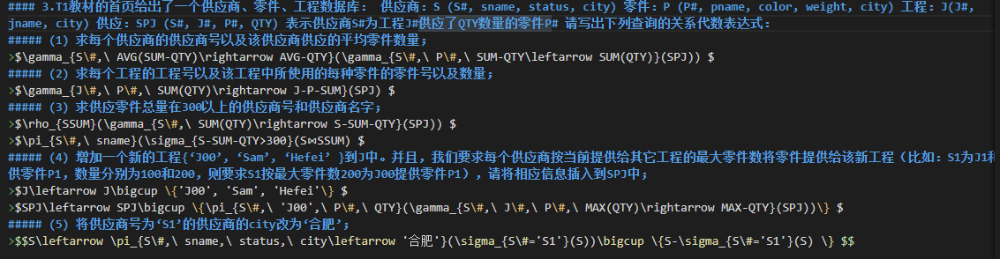

# HW2
#### 1.请使用关系代数的 5 个基本运算表示交、自然连接、Theta 连接以及除操作。
>交： $R\bigcap S=(R\bigcup S)-(R-S)\bigcup (S-R) $  
>自然连接： $R⋈S=\pi_{所有不重复属性} (\sigma_{R.公共属性=S.公共属性}(R\times S))$   
>$\theta$连接：$R⋈_{A\theta B}=\sigma_{(R.A) \theta (S.B)}(R\times S) $  
>除操作：$R\div S=\pi_{X}(R)-\pi_{X}((\pi_{X}(R)\times S)-R) $
#### 2.给定下面的关系模式：图书（图书号，书名，作者，单价，库存量），读者（读者号，姓名，工作单位，地址），借阅（图书号，读者号，借期，还期，备注）请使用关系代数表达式回答下列查询（注意：字符串须用单引号括起来）：
##### (1) 检索读者 Rose的工作单位和地址；
>$\pi_{工作单位,\ 地址}(\sigma_{姓名='Rose'}(读者)) $
##### (2) 检索读者 Rose所借阅过的图书的图书名和借期；
>$\pi_{图书名,\ 借期}(\sigma_{姓名='Rose'}(图书⋈读者⋈借阅)) $
##### (3) 检索未借阅图书的读者姓名；
>$\pi_{姓名}(读者)-\pi_{姓名}(读者⋈借阅) $
##### (4) 检索Ullman所写的书的书名和单价；
>$\pi_{书名,\ 单价}(\sigma_{作者='Ullman'}(图书) ) $
##### (5) 检索借阅图书数目超过3本的读者姓名。
>$\rho_{BORROW}(\gamma_{读者号,\ COUNT(图书号)\rightarrow借阅数}(借阅)) $    
>$\pi_{姓名}(\sigma_{借阅数>3}(读者⋈BORROW)) $  

备注：由于遇到了一点不明bug，我的markdown内嵌Latex在第三题转换PDF时总是乱码，于是第三题是preview的截图，为了自证我是自己完成的作业，下面贴上我的第三题markdown源码：
