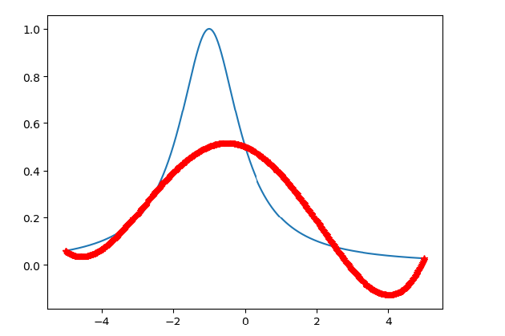
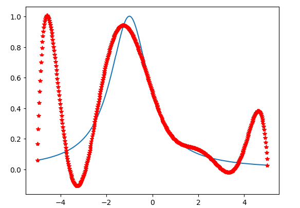
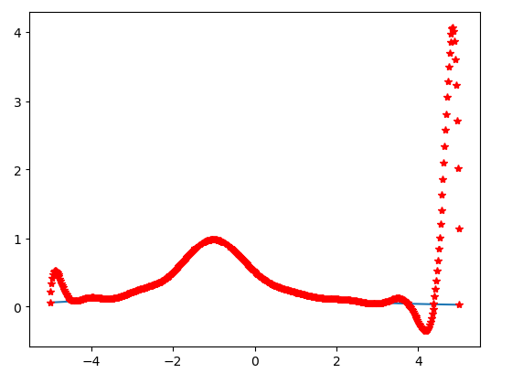
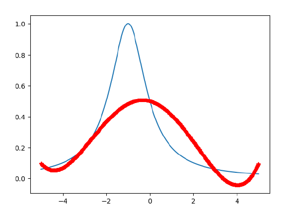
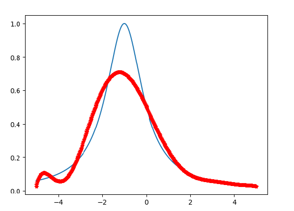
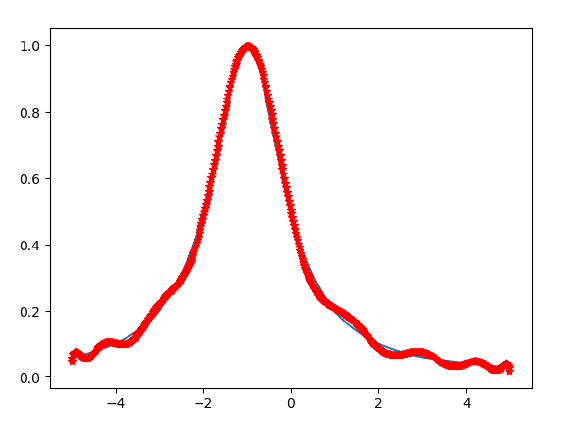

# LAB 2
## PB17111614 王嵘晟
### 1. 实验结果：
(1) $x_{i}=-5+\frac{10}{N}i\ i=0,1,...,N $ 第一组节点，误差为  
N=4,  5.003328739308E-001  
对应图像：  注：以下图像均横轴表示X轴，纵轴表示Y轴，蓝色表示f(x)原图像，红色表示Lagrange插值函数图像  
    
N=8,  9.330226091782E-001  
    
N=16, 4.036628088374E+000  
   
(2) $x_{i}=-5cos(\frac{2i+1}{2N+2}\pi )\ i=0,1,...,N $ 第二组节点，误差为  
N=4,  5.184755296819E-001  
   
N=8,  3.023029404504E-001  
  
N=16, 3.683367441172E-002  
  
### 2.算法分析：
>在构造Lagrange插值函数时，为了尽可能减小不同的计算式带来的误差，我使用了pow函数来代替了除法。
### 3.结果分析：
>首先纵向对比，对于x取值使用$x_{i}=-5+\frac{10}{N}i\ i=0,1,...,N $ 这样的等距插值，随着N的值的增大，误差越来越大。即随着插值节点的数量增多，精度反而下降，这种现象叫做龙格现象。  
当x取值使用$x_{i}=-5cos(\frac{2i+1}{2N+2}\pi )\ i=0,1,...,N $即用Chebyshev点作为插值节点，随着N的取值的增大，误差值越来越小，即随着插值节点的数量增多，精度上升。
### 4.实验小结：
>这个实验让我们先用C语言实现了Lagrange插值函数的构造方法，然后分别使用等距插值和Chebyshev点插值来作为插值节点，进而讨论了这两种不同插值选取方式带来的误差大小。可以得出结论：使用Chebyshev点作为插值节点，可以时Lagrange插值函数更加精确，不会出现龙格现象。